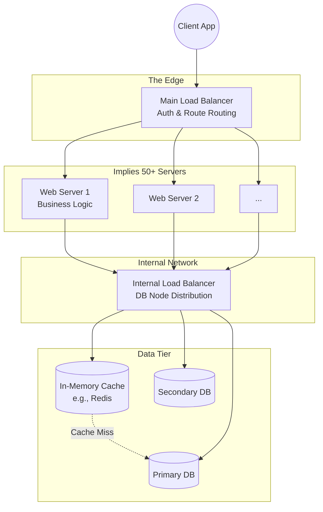

# Architecture Diagram Cheat Sheet

When in a system design interview, your diagram is your primary communication tool. How you sketch the architecture is just as important as the architecture itself. Follow these conventions to draw clean, understandable, and scalable architectures without wasting time.

## 1. Structural Placement Conventions

Knowing exactly where to place specific components shows architectural maturity.

*   **The Edge Load Balancer**: Always place your primary Load Balancer directly at the "edge" of your system (immediately after the client/internet). Its job is to distribute the initial incoming traffic across your web servers.
*   **The Internal Load Balancer**: Load balancers aren't exclusively for edge traffic! You can position internal load balancers deep within your architecture (e.g., in front of multiple databases or microservice clusters) to solve distinct internal distribution and scaling problems.
*   **The Read-Heavy Cache**: For heavily read-dependent applications (handling 100,000+ users), always place a Cache (like Redis or Memcached) directly in front of the Database. The web server should check the cache *before* attempting a costly database read.

## 2. Visualizing Clusters (Saving Time)

Do not waste whiteboard space or time drawing dozens of individual server boxes. 
*   **The Container Convention**: To represent a massive cluster, draw a large container box and place just 2 or 3 small server instances inside it. This universal convention implies to the interviewer that there are many servers (potentially 20, 50, or 100 running independently) without you having to sketch them all out.

## 3. Explicit Component Labeling

A diagram with boxes labeled merely "LB", "App", and "DB" is weak. 
*   **Label the Purpose**: Explicitly label what each component is *doing* to clarify the system flow instantly.
*   *Bad:* "Load Balancer"
*   *Good:* "Load Balancer (Auth & Routing)"
*   *Bad:* "Web Server"
*   *Good:* "Web Server (Business Logic & External API)"

## Perfect Architecture Sketch Example

