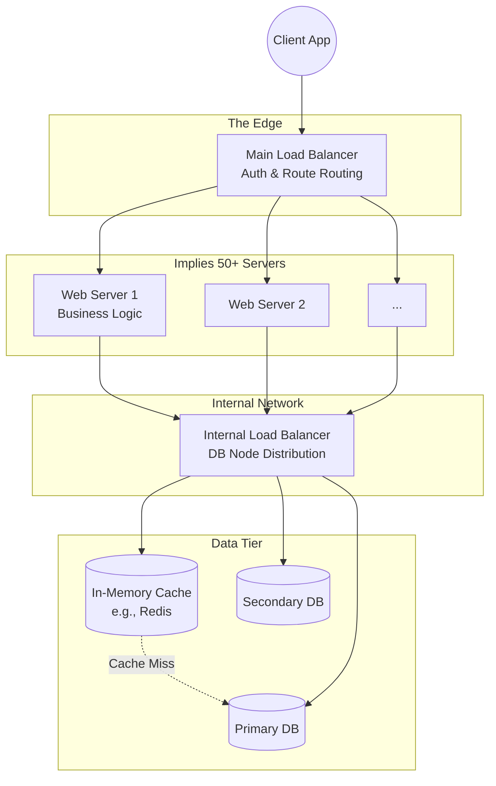
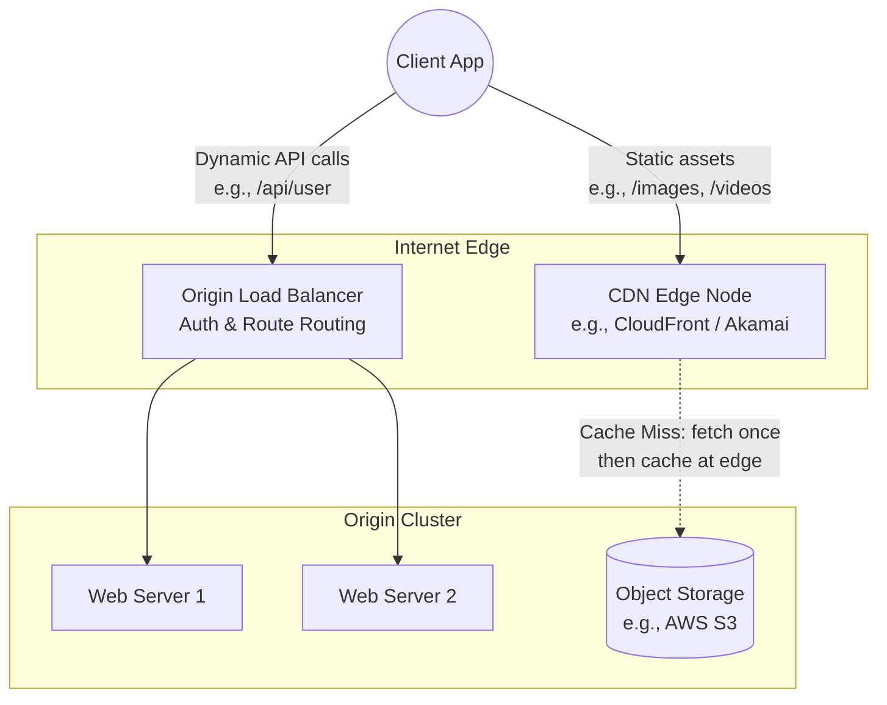
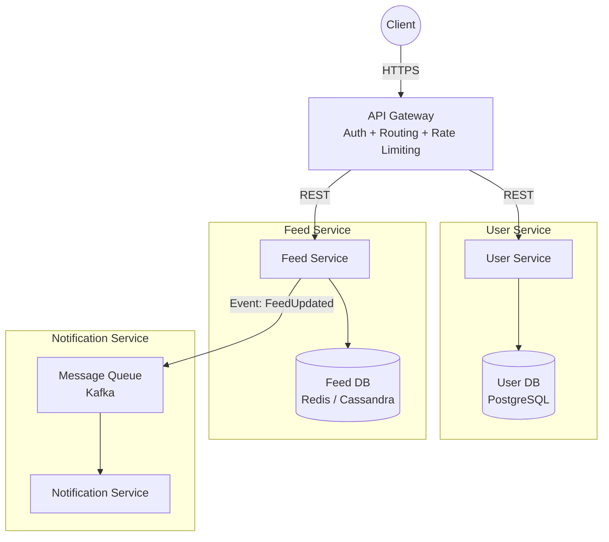

# Architecture Diagram Cheat Sheet

When in a system design interview, your diagram is your primary communication tool. How you sketch the architecture is just as important as the architecture itself. Follow these conventions to draw clean, understandable, and scalable architectures without wasting time.

## 1. Structural Placement Conventions

Knowing exactly where to place specific components shows architectural maturity.

*   **The Edge Load Balancer**: Always place your primary Load Balancer directly at the "edge" of your system (immediately after the client/internet). Its job is to distribute the initial incoming traffic across your web servers.
*   **The Internal Load Balancer**: Load balancers aren't exclusively for edge traffic! You can position internal load balancers deep within your architecture (e.g., in front of multiple databases or microservice clusters) to solve distinct internal distribution and scaling problems.
*   **The Read-Heavy Cache**: For heavily read-dependent applications (handling 100,000+ users), always place a Cache (like Redis or Memcached) directly in front of the Database. The web server should check the cache *before* attempting a costly database read.

## 2. Visualizing Clusters (Saving Time)

Do not waste whiteboard space or time drawing dozens of individual server boxes. 
*   **The Container Convention**: To represent a massive cluster, draw a large container box and place just 2 or 3 small server instances inside it. This universal convention implies to the interviewer that there are many servers (potentially 20, 50, or 100 running independently) without you having to sketch them all out.

## 3. Explicit Component Labeling

A diagram with boxes labeled merely "LB", "App", and "DB" is weak. 
*   **Label the Purpose**: Explicitly label what each component is *doing* to clarify the system flow instantly.
*   *Bad:* "Load Balancer"
*   *Good:* "Load Balancer (Auth & Routing)"
*   *Bad:* "Web Server"
*   *Good:* "Web Server (Business Logic & External API)"

## Perfect Architecture Sketch Example

---

## 4. CDN Placement Convention

A Content Delivery Network (CDN) sits at the outermost edge of the architecture — **between the internet and your origin load balancer**. It intercepts requests for static assets (images, videos, CSS, JS) and serves them from geographically distributed edge nodes, so those requests never reach your origin servers.

**Rule:** Label CDN cache hit vs. cache miss flows explicitly. A cache hit never reaches origin. A cache miss fetches from origin once, then caches at the edge for subsequent requests.

---

## 5. Microservice Architecture Conventions

When drawing a microservice system, use these conventions to keep the diagram readable:

**Service Boundaries:**
- Each microservice gets its **own box** and its **own dedicated data store**. Services never share a database — they communicate only via APIs or events.
- Label the inter-service communication method: `REST`, `gRPC`, `Event` (async).

**Gateway Pattern:**
- Always draw an **API Gateway** at the entry point. It handles routing, auth, rate limiting, and protocol translation — clients never call internal services directly.

---

## 6. Quick Component Legend

Use consistent symbols across your diagrams for immediate readability:

| Symbol | Component |
|:---|:---|
| `((Circle))` | Client / User / External System |
| `[Rectangle]` | Server, Service, or Worker |
| `{Diamond}` | Load Balancer or Decision Point |
| `[(Cylinder)]` | Database or Persistent Storage |
| `[(Cache)]` | Cache (label with Redis/Memcached) |
| `[/Parallelogram/]` | Event / Message / Queue |
| Solid arrow `-->` | Synchronous request |
| Dashed arrow `-.->` | Asynchronous / optional / fallback |
| `subgraph` box | Cluster, region, or service boundary |
