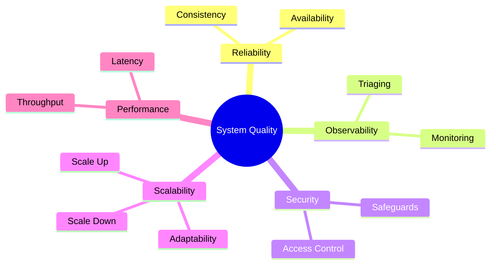

# Functional vs Non-Functional Requirements

## The Core Relationship

While *Functional Requirements* define what the system does, **Non-Functional Requirements (NFRs)** define how well the system performs its functions. 

NFRs are fundamentally about understanding and targeting **System Quality Attributes** (such as consistency, availability, and fault tolerance). During the scoping phase, clarifying constraints around expected user load, required response times, and downtime tolerance directly informs which quality attributes you must prioritize. In distributed systems, establishing these quality baselines serves as the primary driver behind all of your architectural trade-offs.

There are five key indicators of system quality (NFRs):

All of these are vital and constantly involve trade-offs depending on the system's needs.

### 1. Reliability
Focuses on making sure the system provides accurate data and stays online (often balancing Consistency vs Availability as per the CAP theorem).

### 2. Observability
**Q: What is the relationship between system observability and effective troubleshooting?**
A: System observability is critical for troubleshooting because it provides necessary insight into the internal state of the system when something fails. Poor observability means you only discover errors when a failure occurs and you have no data to diagnose it. Good observability includes proper logging, metrics, and alerting so that issues can be quickly triaged before customers report them or call centers get overwhelmed.

### 3. Scalability
**Q: Why is it important to design systems that can scale both up and down rather than just up?**
A: Designing systems to scale both up and down is vital for cost efficiency and resource management. Running systems at maximum capacity at all times is highly inefficient. Many applications experience seasonality (like e-commerce during Black Friday versus January). Cloud computing allows systems to scale up during high-traffic periods and scale down during quieter times, significantly optimizing resource usage and cost.

### 4. Performance
Relates broadly to how fast and how much data the system can handle. (See `tradeoffs.md` for deep-dives into Latency vs Throughput and more!).

### 5. Security (and Safeguards)
**Q: What is Chesterton's fence and how does it relate to system security?**
A: **Chesterton's fence** is a principle suggesting that before removing or dismissing existing safeguards, you must first understand why they were originally put in place (like someone opening a gate without realizing there's a dangerous bull on the other side). In system security, this means assuming that previous developers implemented security measures for good reasons (like strict regulatory compliance, logging, or auditing) and not bypassing them without understanding their underlying necessity.
