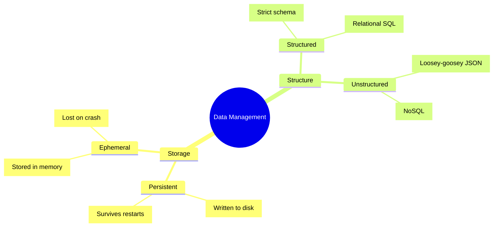

# System Trade-Offs

When designing a system, there is rarely a perfect choice. Every major architectural decision involves a trade-off.

## Performance: Latency vs Throughput

A classic trade-off in distributed systems is choosing whether to optimize for speed (Latency) or volume (Throughput). 

**Q: In the context of system performance, what is the difference between latency and throughput, and when is each more important?**
A: **Latency** is how quickly a system responds to a request, while **throughput** is the amount of data a system can handle over a given time. 
- *Latency* is more important for applications like shopping carts where users expect immediate feedback and will abandon slow-loading pages. 
- *Throughput* is more important for applications handling massive data volumes, such as video streaming, real-time mapping, autonomous cars, or AI models processing millions of data points.

## Data Consistency: Strict vs Eventual

Determining exactly how consistent your data needs to be is one of the most critical tradeoffs you will make. It directly dictates what kind of database you use and how you handle replication.

- **Strict Consistency (Critical):** In a stock market trading platform, money is constantly at stake. Transactions *must* depend on perfectly accurate, globally synchronized stock prices. In this scenario, consistency must be tightly prioritized over absolute availability. A user would rather see an error than make a trade based on an outdated price.
- **Eventual Consistency (Acceptable):** In contrast, an application like a news homepage or a social media feed can comfortably tolerate slightly outdated data. If a user sees a news headline or a 'like' count that is a few minutes delayed, it does not significantly impact their core user experience. Here, keeping the system highly available and responsive is far more important than strict, blocking synchronization.

## Performance vs Security

Security measures inherently introduce latency into a system. Every safeguard, validation step, or encryption cycle requires computational overhead. 

### Why Encryption Is Expensive at Scale

All cryptographic operations are **computationally expensive by design** — that is precisely what makes algorithms like AES-256 and SHA-512 difficult to break. At the level of a single request, the cost of encrypting or decrypting a payload is negligible and completely invisible to the user. However, at the scale of **millions of requests per second**, those tiny per-request costs compound into significant CPU overhead that can become the dominant performance bottleneck in your system.

This is why the question of *where* to terminate encryption is one of the most critical performance-vs-security tradeoffs in distributed architecture.

### The SSL/TLS Termination Spectrum

Where you choose to decrypt HTTPS traffic directly reflects your position on the performance ↔ security spectrum:

*   **Terminate at the Load Balancer (Performance-biased):** Internal traffic flows as plain HTTP. Fast, efficient, and simple — but every internal service sees unencrypted data.
*   **End-to-End Encryption (Security-biased):** Traffic remains encrypted until the final destination service. Slower and operationally complex, but no intermediate system can read or tamper with the data.

### HIPAA & Compliance-Driven Security

Consider the requirement of **HIPAA compliance** for handling medical data. HIPAA mandates that all sensitive data must be encrypted at rest and in transit. This means the database CPU must execute rigorous encryption and decryption cycles for every single read and write request, fundamentally slowing down the baseline performance. Furthermore, when these encrypted databases need to synchronize or communicate with external microservices, they are forced to perform extensive security handshakes, compounding network latency and architectural complexity. While legally and ethically vital, these safeguards stand as a direct tradeoff against raw system speed.

### The Logging Trap

A frequently overlooked security risk when terminating SSL/TLS early: **logging services**. Most production systems automatically copy request payloads into log databases for debugging. If SSL/TLS is terminated at the edge and requests contain passwords, credit card numbers, or health records, those logs become a massive, unencrypted repository of sensitive data — broadly accessible to anyone with log access. Logs must be aggressively scrubbed of sensitive fields, and access to log databases must be tightly controlled and audited.

**Q: What is the tradeoff when implementing end-to-end encryption for transaction data in a microservices architecture?**
A: Normally, HTTPS traffic is decrypted at the API gateway or edge to make processing faster within the internal network and avoid computational overhead. However, if strict data protection requires data to be encrypted in-transit throughout the *entire* system until it reaches the database (end-to-end encryption), every single microservice must decrypt the data to process it. This is computationally expensive, significantly increasing latency and impacting overall system performance.

## Simplicity vs. Complexity (Over-engineering)

A guiding principle in system design should always be: **focus on the simplest, cheapest thing that solves the problem.** It is a common pitfall to automatically reach for the most rigorous or seemingly state-of-the-art architectural patterns when a simpler approach would suffice.

### Endpoint Granularity: Combined vs. Separate
When designing an API, you frequently face the tradeoff of whether to create separate endpoints for different operations or to lump them together into a single, unified endpoint:
*   **The Expense Tradeoff:** The decision often hinges on the complexity and computational expense of the underlying operation. For example, if an operation involves an expensive, heavy calculation (like aggregating and comparing multiple historical stock ticker arrays), it almost always warrants its own dedicated endpoint. Lumping it together with an otherwise lightweight operation (like fetching a user's display name) forces the entire system to wait on the slowest component, driving up aggregate latency and wasting compute resources if the client only needed the display name.

### The GraphQL Trap
**Q: When designing a system's API, when might you explicitly avoid using a sophisticated solution like GraphQL?**
**A:** You should avoid GraphQL when the API is simple enough that it does not merit the added structural complexity. If a system only needs a few straightforward endpoints to execute basic CRUD operations, a simple REST-based HTTP approach is far cheaper, easier to maintain, and natively supports edge-caching without the heavy backend resolvers, schemas, and performance tuning that GraphQL inherently requires.

## Data Management: Storage & Structure

Choosing how and where data lives determines your system's durability, speed, and flexibility. 

### 1. Persistent vs Ephemeral Storage
- **Persistent Storage:** Data is written to disk (e.g., hard drives, SSDs) and will survive system restarts or power losses. It is essential for source-of-truth data (user profiles, transaction histories) that must be available later. The trade-off is that disk I/O is comparatively slow.
- **Ephemeral Storage:** Data is only stored temporarily, typically in memory (RAM). It is incredibly fast but will be entirely lost if the machine restarts or crashes. This is appropriate for short-lived data like caching layers, session states, or in-flight calculations.

### 2. Structured vs Unstructured Data
- **Structured Data:** Data has a strictly defined schema, similar to object-oriented programming with clear relationships between objects. This data fits perfectly into rows and columns. **Relational databases (SQL)** excel here.
- **Unstructured Data:** Data is "loosey-goosey", lacking a rigid schema. It might be stored as JSON blobs with varying or overlapping fields. **Non-relational databases (NoSQL)** like document stores are better suited for this flexibility.

## Scaling: Vertical vs. Horizontal

As traffic grows, you must scale your system. The choice of *how* to scale represents a massive architectural pivot.

*   **Vertical Scaling (Scaling Up):** Involves buying a bigger, faster server (more CPU, RAM, Disk).
    *   *Tradeoff:* It is incredibly **simple** (requiring no code changes), but it introduces a terrifying **Single Point of Failure**. Furthermore, there's a hard physical limit to how powerful one specific machine can get.
*   **Horizontal Scaling (Scaling Out):** Involves adding many more commodity servers and distributing the load.
    *   *Tradeoff:* It offers essentially **infinite scale and high resiliency** (if one server dies, the rest pick up the slack). However, it massively increases **architectural complexity**. You now need load balancers, orchestrators, and distributed messaging systems like Apache Zookeeper to keep the fleet of machines synchronized.
