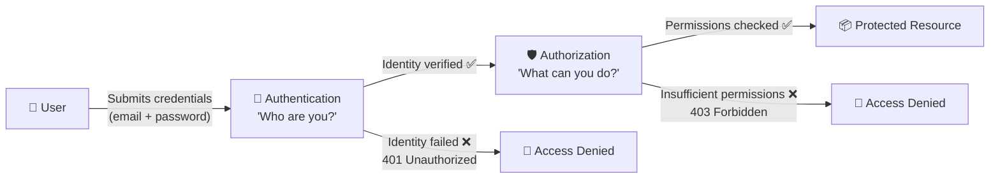
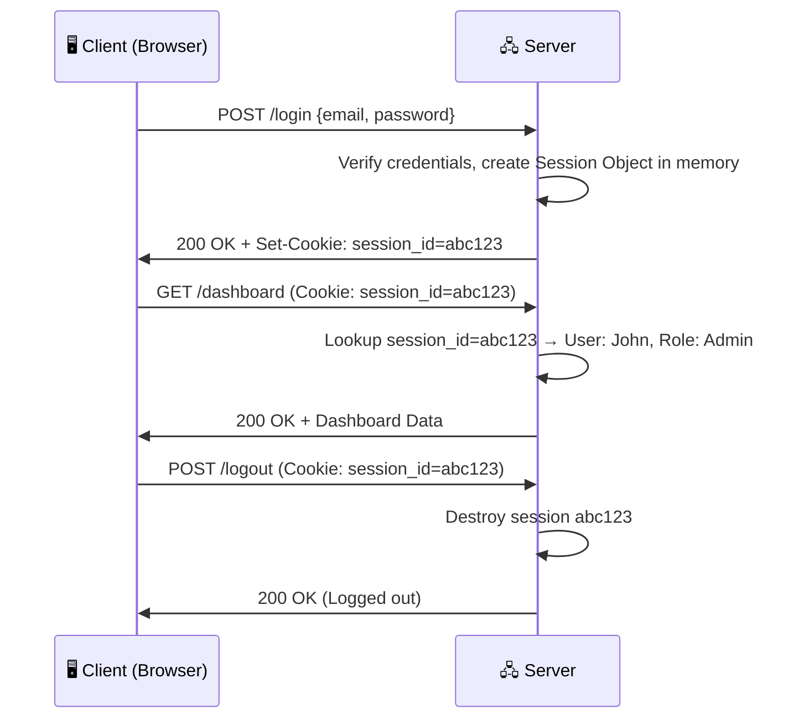
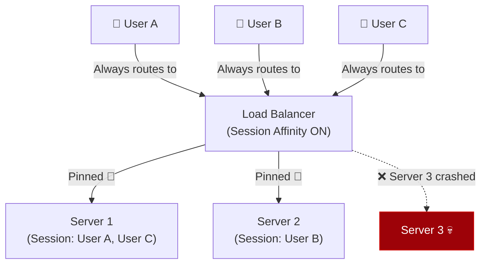
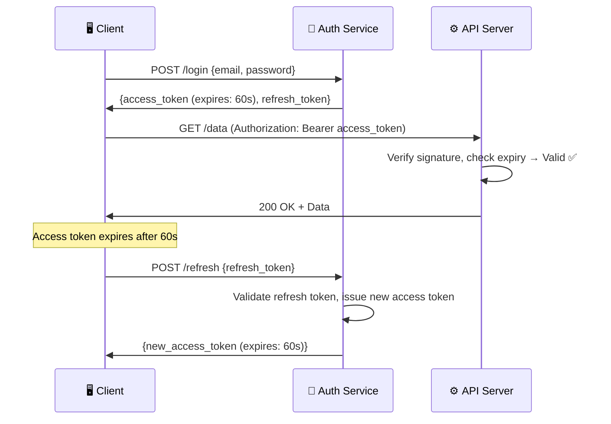
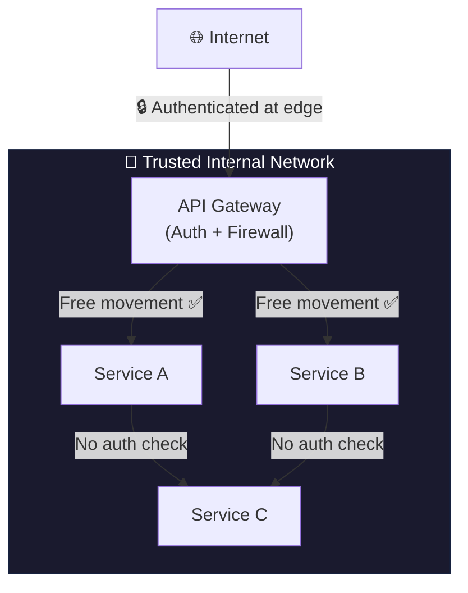
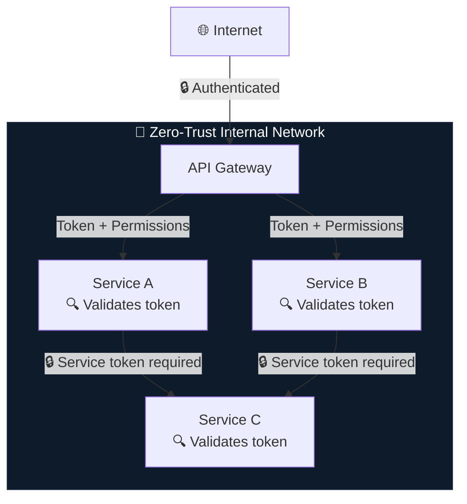
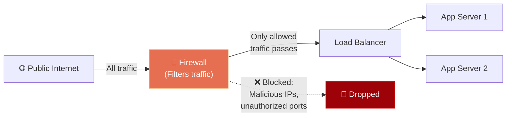
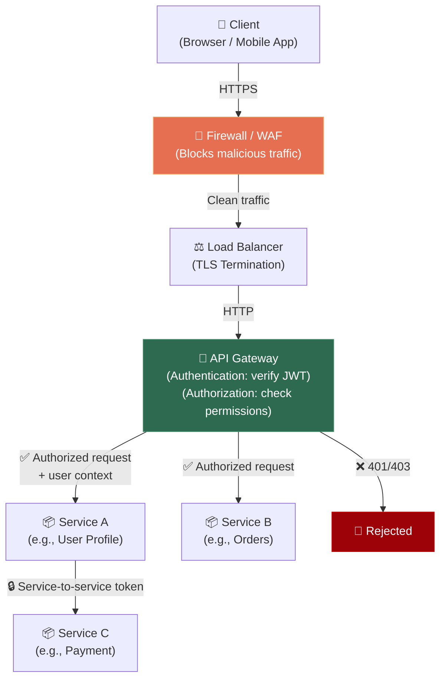

# Authentication, Authorization & Security in Distributed Systems

Understanding how systems verify *who* a user is, *what* they're allowed to do, and how these mechanisms behave at scale is one of the most critical — and most frequently confused — areas of system design. This document breaks down each concept from first principles, explains how they interact with load balancing, scaling, and microservice architectures, and highlights the real-world trade-offs engineers face every day.

---

## 1. Authentication vs. Authorization

These two words sound almost identical, but they answer fundamentally different questions. Confusing them is one of the most common mistakes in system design discussions.

### Authentication — "Who Are You?"

Authentication is the process of **verifying a user's identity**. Before the system can do anything useful, it must first confirm that the person making the request is actually who they claim to be.

*   **How it works in practice:** A user submits credentials — typically an email and password — and the system checks those credentials against a stored record. If they match, the user is "authenticated."
*   **Real-world analogy:** Think of authentication as a bouncer at a nightclub checking your government-issued ID at the door. The bouncer doesn't care *what* you want to do inside — they just need to confirm you are who you say you are.

**Real-world examples:**
| Service | Authentication Method |
| :--- | :--- |
| **Google/Gmail** | Email + Password, then a second factor (2FA via phone prompt or authenticator app) |
| **GitHub** | Password + SSH key or Personal Access Token for API/CLI access |
| **Banks (Chase, HDFC)** | Username + Password + OTP (One-Time Password sent to registered mobile) |
| **AWS Console** | IAM user credentials + optional MFA (Multi-Factor Authentication) hardware key |

### Authorization — "What Are You Allowed to Do?"

Authorization happens *after* authentication. Once the system knows who you are, it must determine **what permissions you have** — which resources you can access and which actions you can perform.

*   **How it works in practice:** After login, every subsequent request carries a token or session ID. The system inspects this token to check the user's role, permissions, or access level before allowing the requested action.
*   **Real-world analogy:** After the bouncer lets you into the nightclub (authentication), your wristband color determines what you can do — a general wristband gets you the main floor, a VIP wristband gets you backstage access. The wristband is your authorization.

**Real-world examples:**
| Scenario | Authorization Logic |
| :--- | :--- |
| **Google Drive** | You're logged in (authenticated), but you can only view a shared document, not edit it — because the owner granted you "Viewer" access, not "Editor" |
| **GitHub Repository** | You're authenticated as a user, but you can only *read* a private repo if the owner has granted you collaborator access. Without it, you get a 403 Forbidden |
| **AWS IAM Policies** | An authenticated developer might have permission to read S3 buckets but *not* to delete EC2 instances — controlled by IAM policy documents |
| **Uber Driver App** | A driver is authenticated but is *not authorized* to access rider payment details — role-based access control restricts visibility |

### The Critical Distinction

> **Key Insight:** Authentication always comes first. You cannot authorize someone whose identity you haven't verified. A `401 Unauthorized` HTTP status actually means "unauthenticated" (identity not proven), while `403 Forbidden` means "authenticated but not authorized" (identity is known, but permissions are insufficient).

---

## 2. Session-Based Authentication (Stateful)

The traditional approach to maintaining a user's authenticated state across multiple HTTP requests.

### How It Works

Remember that HTTP is **inherently stateless** — every request is brand new to the server. So after a user logs in, the server needs a mechanism to "remember" them on subsequent requests. Session-based authentication solves this by storing session data **on the server side**.

1.  **Login:** The user sends their credentials. The server verifies them and creates a **session object** in server memory (or a session store like Redis). This session object contains the user's identity, permissions, and metadata.
2.  **Session ID:** The server generates a unique, random **Session ID** and sends it back to the client as a cookie.
3.  **Subsequent Requests:** On every future request, the browser automatically attaches the session cookie. The server looks up the Session ID in its session store, finds the associated user data, and knows who is making the request.
4.  **Logout:** The server destroys the session object. The Session ID becomes meaningless.

### Advantages

*   **Instant Revocation:** If a user's account is compromised, you can immediately destroy their session on the server. The very next request they make is rejected. There is no window of vulnerability.
*   **Simpler Mental Model:** Sessions map intuitively to real-world behavior — a session starts when you open your browser and ends when you close the tab or click "logout."
*   **Server-Controlled:** The server has full authority over the session's lifetime, data, and validity at all times.

### Disadvantages

*   **Stateful — The Scaling Problem:** The session data lives in the server's memory. This means the server is *stateful* — it must remember something between requests. This creates a direct conflict with horizontal scaling, which is discussed in the next section.

---

## 3. Sticky Sessions — The Hidden Trap of Stateful Authentication

This is where authentication directly collides with scaling, and where many systems silently break.

### The Problem

Imagine you have three web servers behind a load balancer. A user logs into **Server A**, which creates a session object in Server A's local memory. On the user's next request, the load balancer (using round-robin or another algorithm) routes the request to **Server B**. But Server B has no idea who this user is — the session object exists only on Server A. The user is suddenly logged out for no apparent reason.

### The "Fix" — Sticky Sessions

A **sticky session** (also called **session affinity**) is a load balancer configuration that forces *every request from a specific client* to always go to the *same backend server*. The load balancer inspects the session cookie (or client IP) and pins that user to a specific server.

### Why Sticky Sessions Are Dangerous

While sticky sessions solve the immediate problem, they introduce severe architectural weaknesses:

1.  **Server Failure = User Loss:** If Server 1 crashes, User A and User C lose their sessions entirely. They are forcibly logged out. In a properly stateless system, their requests would seamlessly failover to another server.
2.  **Uneven Load Distribution:** If many high-traffic users happen to be pinned to the same server, that server becomes overloaded while others sit idle. The load balancer can no longer freely distribute traffic optimally.
3.  **Scaling Becomes Painful:** When you add a new server to the pool, existing users remain pinned to their original servers. The new server sits underutilized. When you remove a server, all pinned users must be forcibly disconnected and re-authenticated.
4.  **Breaks the Fundamental Promise of Horizontal Scaling:** Horizontal scaling works because *any server can handle any request*. Sticky sessions violate this principle by coupling a client to a specific server instance.

> **Key Takeaway:** Sticky sessions are not a solution — they are a **band-aid** that trades horizontal scalability for short-term convenience. This is precisely why modern architectures push authentication to the **edge** (API gateway or auth service) or use **stateless tokens** (JWTs) to eliminate server-side session dependency entirely.

**Real-world tools that handle this:**
*   **AWS Elastic Load Balancer** supports sticky sessions as an option but explicitly warns against overreliance.
*   **Nginx** supports `ip_hash` directive for session affinity but recommends external session stores for production.

---

## 4. JWT (JSON Web Tokens) — Stateless Authentication

JWTs represent a fundamentally different philosophy: instead of the server remembering who you are, the server gives you a **self-contained proof of identity** that you carry with you on every request.

### How It Works

1.  **Login:** The user sends credentials. The server verifies them and generates a **JWT** — a cryptographically signed token containing the user's identity and permissions, encoded as a compact JSON string.
2.  **Token Delivered:** The server sends the JWT back to the client. The client stores it (usually in `localStorage` or a cookie).
3.  **Subsequent Requests:** On every future request, the client attaches the JWT in the `Authorization` header. The server **does not look anything up** — it simply verifies the token's cryptographic signature to confirm it hasn't been tampered with, reads the embedded claims (user ID, role, expiration), and processes the request.
4.  **No Server-Side State:** The server stores absolutely nothing. The token *is* the session.

### Why This Matters for Distributed Systems

Because no server-side state exists, **any server in the cluster can validate any request**. The load balancer can route traffic using pure round-robin or least-connections without worrying about which server the user originally logged into. This is what makes JWTs the natural fit for horizontally scaled architectures and microservices.

### The Trade-Off: Short-Lived Tokens & Refresh Tokens

JWTs have a critical weakness: **they cannot be revoked**. Once issued, a JWT is valid until it expires. If a token is stolen, the attacker can impersonate the user for the token's entire lifetime.

The industry solution is the **short-lived access token + refresh token** pattern:

*   **Access Token:** Extremely short-lived (30 seconds to a few minutes). Used for every API request. If stolen, the attacker's window of opportunity is tiny.
*   **Refresh Token:** Longer-lived (hours to days). Stored securely. Used *only* to request a new access token when the current one expires. The refresh token itself can be revoked server-side.

**Real-world usage:**
*   **Auth0, Firebase Auth, Okta** — All issue short-lived JWTs with refresh token flows.
*   **Google APIs** — OAuth 2.0 access tokens expire in 1 hour; refresh tokens are used to obtain new ones.
*   **Spotify, GitHub, Stripe APIs** — Use OAuth 2.0 bearer tokens (often JWTs) for stateless API authentication.

---

## 5. Stateful vs. Stateless Authentication — The Complete Picture

This is the single most important architectural decision around authentication in distributed systems. Let's crystallize the comparison:

| Dimension | Stateful (Session-Based) | Stateless (JWT-Based) |
| :--- | :--- | :--- |
| **Where state lives** | Server memory or session store (e.g., Redis) | Inside the token itself (client carries it) |
| **Scaling** | Requires sticky sessions or shared session stores | Any server can validate any request — frictionless horizontal scaling |
| **Revocation** | Instant — destroy the session server-side | Difficult — token is valid until expiry. Requires short-lived tokens + refresh flow |
| **Server failure impact** | Users pinned to crashed server lose sessions | Zero impact — any other server picks up seamlessly |
| **Implementation complexity** | Simpler to implement initially | More complex (token signing, refresh flows, key rotation) |
| **Microservice friendliness** | Poor — every service needs access to the session store | Excellent — services independently verify tokens using the public key |
| **Best for** | Simple monoliths, rapid prototyping | Distributed systems, microservices, mobile/SPA clients |

> **Why stateless wins at scale:** In a microservice architecture, dozens of independent services need to verify a user's identity. With session-based auth, *every* service would need to query a centralized session store on *every* request — creating a single point of failure and a performance bottleneck. With JWTs, each service independently verifies the token's signature using the auth service's public key, requiring zero network calls to validate identity.

---

## 6. Microservice Security Models

When a system is decomposed into many small, independent services (microservices), a new security question emerges: **How much should services trust each other?**

There are two dominant philosophies, and they sit at opposite ends of a spectrum:

### Model 1: Castle-and-Moat (Perimeter Defense)

Build an extremely strong outer wall. Once a request passes through the front gate (authentication at the edge), it can move freely between internal services without further checks.

**Advantages:**
*   Much simpler to build and maintain. Internal services don't need auth logic.
*   Lower latency — no validation overhead on internal service-to-service calls.
*   Faster development velocity — teams ship features without security ceremony.

**Disadvantages:**
*   **Social engineering vulnerability:** If an attacker breaches the perimeter (phishing, credential theft, insider threat), they have unrestricted access to *every* internal service.
*   **Breaches go undetected:** Without internal checkpoints, a compromised service can silently exfiltrate data from any other service.
*   **Blast radius is total:** One breach = full system compromise.

**Real-world examples:**
*   Many early-stage startups and smaller companies use this model for speed. 
*   Traditional corporate intranets historically followed this pattern — VPN access granted implicit trust to everything.

### Model 2: Zero Trust (Explicit Verification)

**Never trust, always verify.** Every single service-to-service request must carry explicit proof of authorization. No request gets implicit trust, regardless of whether it originates from inside or outside the network.

**Advantages:**
*   **Massively reduced blast radius:** If one service is compromised, it cannot access other services without proper credentials. The damage is contained.
*   **Audit trail:** Every inter-service call is authenticated and logged, making it trivial to detect anomalous behavior.
*   **Compliance-ready:** Required by frameworks like **SOC 2**, **PCI-DSS**, and **HIPAA**.

**Disadvantages:**
*   Heavier engineering effort — every service must implement token validation logic.
*   Higher latency — every hop requires cryptographic verification.
*   More complex infrastructure — requires a centralized identity provider (e.g., **service mesh** like Istio, or **mTLS** certificates).

**Real-world examples:**
*   **Google's BeyondCorp** — Google pioneered the zero-trust model. Every request to any internal service requires authentication, even from within Google's own network.
*   **Netflix** — Uses mTLS (mutual TLS) between all microservices, ensuring every service proves its identity to every other service.
*   **AWS IAM Roles** — Each AWS service/resource has its own permission policy. An EC2 instance must have explicit IAM role permissions to access an S3 bucket, even though both are "inside" the same AWS account.

---

## 7. Firewalls — The Gatekeeper of Network Traffic

A **firewall** is a network security device (hardware or software) that monitors and controls incoming and outgoing network traffic based on predetermined security rules. Think of it as a strict customs checkpoint at a country's border.

### How Firewalls Work

A firewall inspects every network packet attempting to enter or leave a network boundary and makes a decision: **allow** or **block**.

*   **IP-Based Rules:** Block all traffic from known malicious IP ranges. Allow traffic only from specific trusted IPs (e.g., your office network).
*   **Port-Based Rules:** Only allow traffic on specific ports. For example, allow port 443 (HTTPS) and port 22 (SSH), but block everything else.
*   **Protocol-Based Rules:** Allow HTTPS but block raw TCP connections or FTP.

### Where Firewalls Sit in System Architecture

Firewalls typically sit at the **outermost edge** of your infrastructure, before even the load balancer. They act as the first line of defense, filtering out obviously malicious or unauthorized traffic before it ever reaches your application layer.

### Types of Firewalls

*   **Network Firewall (Traditional):** Operates at the network/transport layer (Layers 3-4). Filters based on IP addresses, ports, and protocols. Fast but cannot inspect the *content* of requests.
*   **Web Application Firewall (WAF):** Operates at the application layer (Layer 7). Can inspect the actual HTTP request content and block attacks like SQL injection, cross-site scripting (XSS), and API abuse. Slower but far more intelligent.
*   **Cloud-Native Firewalls:** Services like **AWS Security Groups**, **Azure NSGs**, and **Google Cloud Firewall Rules** act as virtual firewalls controlling traffic to/from cloud resources.

**Real-world examples:**
| Tool | Type | Used By |
| :--- | :--- | :--- |
| **AWS WAF** | Web Application Firewall | Netflix, Airbnb, countless AWS-hosted apps |
| **Cloudflare** | WAF + DDoS protection + CDN | ~20% of the entire internet uses Cloudflare for traffic filtering |
| **AWS Security Groups** | Network-level virtual firewall | Every EC2 instance has security group rules controlling inbound/outbound ports |
| **pfSense** | Network firewall (self-hosted) | Enterprises running on-premise data centers |

> **Key Distinction:** A firewall controls *which traffic is allowed into your network*. Authentication controls *which users are allowed to use your application*. They operate at completely different layers but are both essential components of a defense-in-depth security strategy.

---

## 8. Putting It All Together — A Complete Auth Architecture

Here's how authentication, authorization, firewalls, and microservice security combine in a modern production system:

**The flow:**
1.  **Firewall / WAF** blocks obviously malicious traffic (DDoS, SQL injection attempts, blacklisted IPs).
2.  **Load Balancer** terminates TLS, distributes traffic across healthy servers.
3.  **API Gateway** handles authentication (verifies the JWT signature and expiry) and authorization (checks if the user's role has permission for the requested endpoint).
4.  **Microservices** process the request. In a zero-trust model, inter-service calls also carry tokens or use mTLS for mutual authentication.
