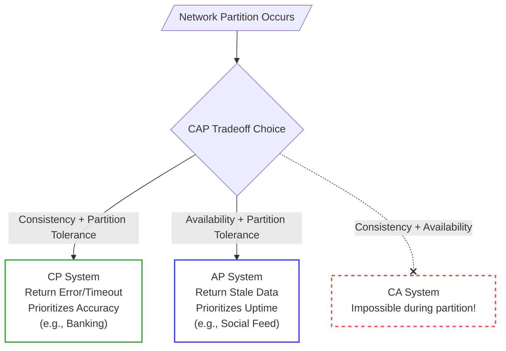

# CAP Theorem

## Definition
The CAP theorem states that any distributed data store can only simultaneously provide **two** out of the following **three** guarantees:

1. **Consistency (C)**: Every read receives the most recent write or an error. When data is written to one node, it is instantly replicated or available to all other nodes in the system before a read can happen.
2. **Availability (A)**: Every request receives a non-error response, but without the guarantee that it contains the most recent write. If a node is up, it will serve data, even if that data is slightly stale.
3. **Partition Tolerance (P)**: The system continues to operate and function despite an arbitrary number of network packets being dropped or delayed between nodes (a network "partition").

## The Reality of Distribution
Networks are inherently unreliable. Because machines communicating over a network can and will lose connectivity with each other, **Partition Tolerance is virtually mandatory** in any modern distributed system. 

Therefore, the CAP theorem almost always forces you to choose between **Consistency** and **Availability** when a partition occurs:
- **CP (Consistency & Partition Tolerance)**: You prioritize accuracy. If a partition happens, the system will return an error or time out rather than risk serving stale or incorrect data.
- **AP (Availability & Partition Tolerance)**: You prioritize uptime. If a partition happens, the system will return the most recent version of data it has locally, even if it might not be the most up-to-date globally.

## Practical Use Cases
- **Financial/Banking Systems (CP)**: You absolutely cannot have a user overdraw their account balance because one server didn't see a transaction that happened on another server. The system must block reads/writes if it can't guarantee consistency.
- **Social Media Feeds (AP)**: If your feed takes a few extra seconds to show a friend's new photo, nobody gets hurt. The important thing is that the app keeps loading and showing *some* content. The system must stay up.

## Key Insight
**The perfect system doesn't exist, only tradeoffs.** Recognizing whether a system requirement leans toward CP or AP gives you immediate direction on which databases (e.g., strong-consistency vs eventual-consistency) or synchronization tools to select.

## Interview Tip
Before deciding on your database architecture or caching strategy, explicitly ask your interviewer: *"In the event of a network failure, what matters more to our users here? Seeing perfectly up-to-date information (Consistency), or ensuring the service just stays online (Availability)?"*