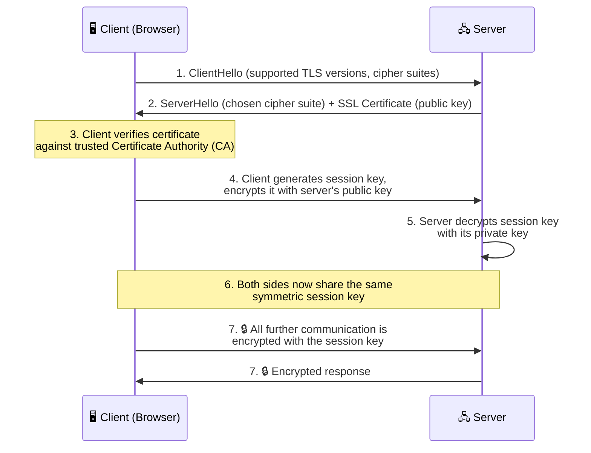
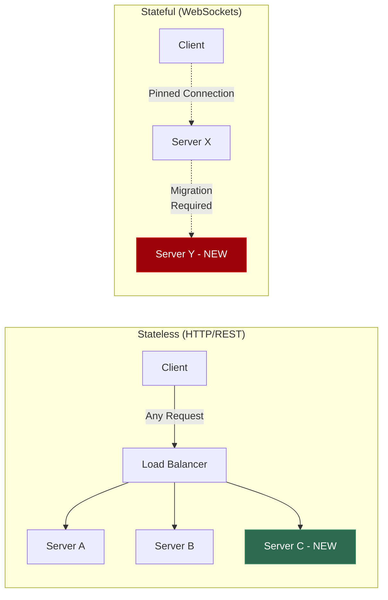
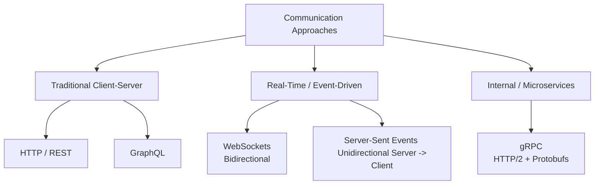
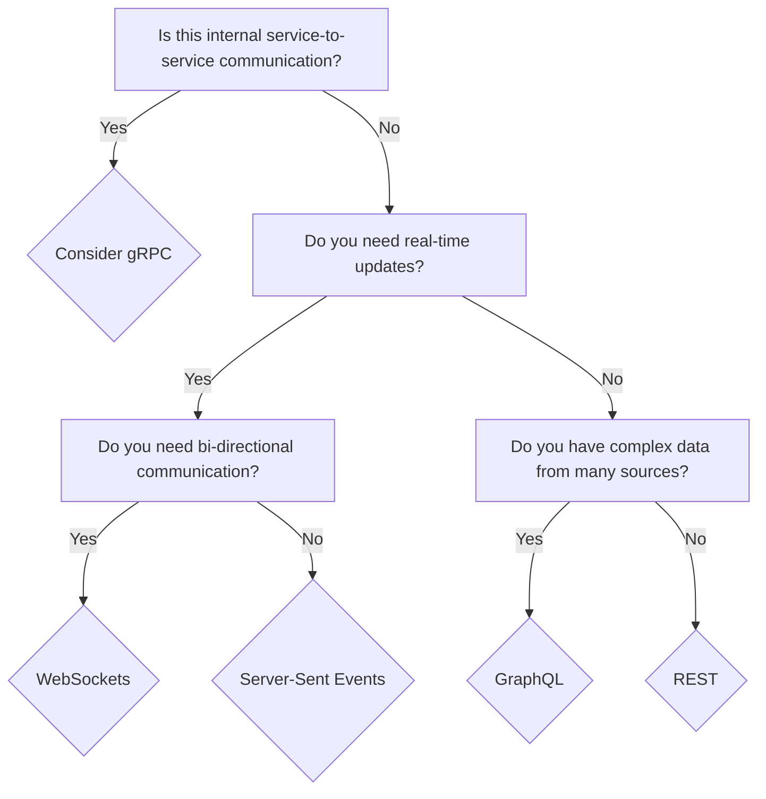

# Communication Protocols in System Design

Understanding how different components of a system communicate is foundational to designing efficient, scalable, and responsive application architectures. Below is a deep dive into the primary protocols and paradigms used in modern web and distributed systems.

## 1. HTTP (HyperText Transfer Protocol)

The backbone of web communication.

*   **Stateless Nature**: HTTP is inherently stateless. Every transaction or request is entirely independent and brand new to the server. The server does not remember previous interactions inherently.
*   **The Challenge**: For modern web applications that require state (e.g., user sessions, shopping carts), developers must explicitly provide context and metadata (such as cookies, session IDs, or JWTs) with every request to maintain continuity.

## 2. HTTPS, SSL & TLS — Securing Data in Transit

HTTP by itself transmits data as plain text. Anyone sitting between the client and the server (an attacker on public Wi-Fi, a compromised router, a malicious ISP) can read, modify, or inject data into the stream. **HTTPS** solves this by wrapping every HTTP request inside an encrypted tunnel.

### The Relationship: HTTP → TLS → HTTPS

These terms are frequently confused, so here's the precise hierarchy:

*   **HTTP** — The application-layer protocol that defines *how* messages are structured (verbs like GET/POST, headers, body). It knows nothing about security.
*   **SSL (Secure Sockets Layer)** — The *original* encryption protocol created in the 1990s. SSL is now **deprecated** due to known vulnerabilities, but the name "SSL" persists colloquially.
*   **TLS (Transport Layer Security)** — The *modern successor* to SSL. When someone says "SSL" today, they almost always mean TLS (currently TLS 1.3). TLS is the actual cryptographic protocol that encrypts data.
*   **HTTPS** — Simply **HTTP + TLS**. It is not a separate protocol; it is standard HTTP running inside a TLS-encrypted connection. The "S" stands for "Secure."

> **Analogy:** Think of HTTP as a postcard — anyone handling it can read the message. HTTPS is a sealed, tamper-proof envelope — the postal workers can see the *destination address* (the domain name), but they cannot open the envelope to read the contents inside.

### How TLS Works: The Handshake Flow

When a client (browser) connects to a server over HTTPS, a multi-step **TLS Handshake** occurs *before* any application data is exchanged:

**Key points about this handshake:**

1.  **Asymmetric encryption** (public/private key pair) is used *only* during the handshake to securely exchange a shared secret. This is the computationally expensive part.
2.  **Symmetric encryption** (the shared session key) is used for *all subsequent data transfer*. Symmetric encryption is dramatically faster than asymmetric encryption, which is why TLS switches to it as quickly as possible.
3.  The **SSL Certificate** is issued by a trusted **Certificate Authority (CA)** and proves the server's identity. Without it, a man-in-the-middle attacker could impersonate the server.

### Why HTTPS Is Non-Negotiable in Modern Systems

*   **Data Integrity:** TLS guarantees that data has not been tampered with during transit.
*   **Authentication:** The certificate proves you are talking to the real server, not an impostor.
*   **Confidentiality:** The encrypted tunnel prevents eavesdropping on sensitive data (passwords, tokens, personal information).
*   **SEO & Browser Trust:** Modern browsers actively flag HTTP sites as "Not Secure," and search engines penalize them in rankings.

---

## 3. WebSockets

When you need real-time, bidirectional communication between a client and a server.

*   **Bidirectional & Persistent**: Unlike HTTP's request-response model, WebSockets establish a persistent connection. Both the client and the server can send messages to each other at any time.
*   **Stateful Connection**: The connection stays open and "remembers" the context, making it stateful.
*   **Low Latency**: Because the connection remains open, it avoids the overhead of establishing a new handshake for every message. This makes it ideal for low-latency applications like chat apps, multiplayer games, or live collaborative editors (like Google Docs).
*   **Mobile Considerations**: WebSockets can heavily drain battery life on mobile devices because they constantly ping the backend to keep the connection alive (heartbeats). Standard HTTP polling can sometimes be a better middle-ground for mobile applications if updates are infrequent.

### Stateful vs. Stateless: The Scaling Implications of WebSockets

The persistent nature of a WebSocket connection introduces a fundamental architectural constraint: **statefulness**. Understanding this distinction is essential for reasoning about system scalability.

*   **Stateless Architecture (e.g., HTTP/REST):** Every request is entirely self-contained and independent. The server retains absolutely no memory of previous interactions. Any server in a horizontally scaled pool can handle any incoming request because no prior context is required. This means you can freely add or remove servers behind a load balancer without disrupting any client—scaling is essentially frictionless.

*   **Stateful Architecture (e.g., WebSockets):** The server *must* maintain an active, in-memory record of each open connection and its associated context. The connection is "pinned" to a specific server instance. This creates a tight coupling between the client and the particular machine it connected to.

**Why Statefulness Cripples Horizontal Scaling:**

When you need to scale a stateful system (adding new servers or decommissioning old ones), you face a brutal challenge: **connection migration**. Every open WebSocket connection is a live, in-memory session bound to a specific server. You cannot simply kill that server; you must gracefully migrate every one of those active connections to a new server without the user noticing a disruption. This is operationally expensive and architecturally complex, often requiring sticky sessions, connection draining strategies, or distributed session stores.

In contrast, stateless services can be scaled elastically with zero migration overhead—spin up a new instance, point the load balancer at it, and it immediately starts serving traffic.

> **Key Takeaway:** This is precisely why Server-Sent Events (SSE) are often preferred over WebSockets when bidirectional communication isn't strictly required. SSE operates over standard HTTP, preserving the stateless, easily scalable nature of the architecture while still enabling real-time server-to-client data push.

## 4. Server-Sent Events (SSE)

An alternative to WebSockets for specific use cases where communication is heavily one-sided.

*   **One-Way Communication**: Server-Sent Events provide a unidirectional channel from the server to the client.
*   **Use Cases**: Perfect for scenarios where the client only needs to receive continuous updates without sending much back—such as live news feeds, stock tickers, or social media timelines.
*   **Versus WebSockets**: If you only need to *push* events to the client and don't care about the client talking back over the same channel, SSE is simpler to implement and runs over standard HTTP, avoiding the complexity of WebSocket connection management.

## 5. gRPC (gRPC Remote Procedure Calls)

A high-performance, open-source universal RPC framework.

*   **Service-to-Service Focus**: Generally, gRPC is the preferred choice for internal, service-to-service communication (backend-to-backend) rather than browser-to-backend.
*   **Why Not Browsers?**: Browsers do not support gRPC natively. Using it requires an additional library or proxy (like gRPC-Web) to interpret the traffic. 
*   **Under the Hood**: It operates exclusively over HTTP/2 and uses Protocol Buffers (Protobufs) instead of JSON. Protobufs are binary, strongly-typed, and highly compressed, making them exceptionally efficient but not human-readable (unlike JSON over standard HTTP).

## 6. GraphQL vs. REST

Modern approaches to structuring API endpoints.

| Feature | REST | GraphQL |
| :--- | :--- | :--- |
| **Data Fetching** | Typically requires multiple requests to separate, distinct endpoints to gather related data. | Can fetch data from multiple underlying sources in a single query. |
| **Efficiency** | Often suffers from over-fetching or under-fetching of data. | Client requests exactly the data it needs, no more, no less. |
| **Use Case Advantage** | Simple, standard architecture leveraging HTTP verbs effectively. | Excellent for complex dashboards (e.g., fetching a user profile, recent news feeds, pictures, and ads simultaneously) under what appears to the client as a single unified endpoint. |

### Why REST is Preferred for Critical APIs (e.g., Banking)

While GraphQL offers excellent flexibility for dynamic frontends, **REST** remains the gold standard for robust, high-stakes infrastructure like banking systems:
*   **Predictable Load**: In GraphQL, clients construct the queries, posing a risk of deeply nested queries maliciously or accidentally overloading the server. REST endpoints return strictly predefined payloads.
*   **Reliability & Simplicity**: REST relies on standard HTTP methods (GET, POST) and status codes. Its simplicity means a lower learning curve, rock-solid reliability, and broad compatibility for third-party integrations.
*   **Native Caching**: REST natively leverages HTTP caching at the network level (CDNs, reverse proxies). GraphQL caching is notoriously complex since queries typically hit a single `POST` endpoint.

## Communication Protocols Taxonomy

## Protocol Decision Tree

