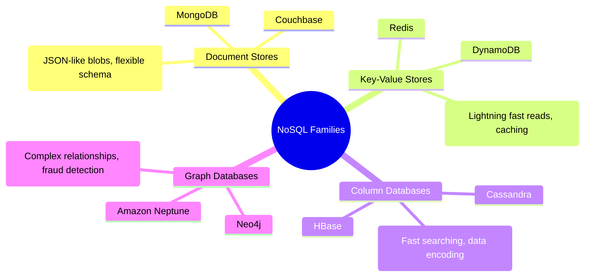
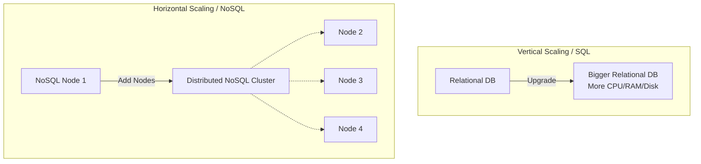
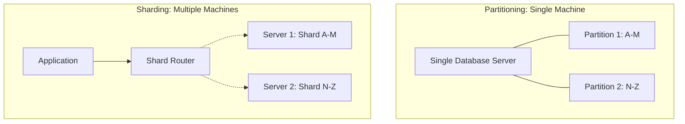
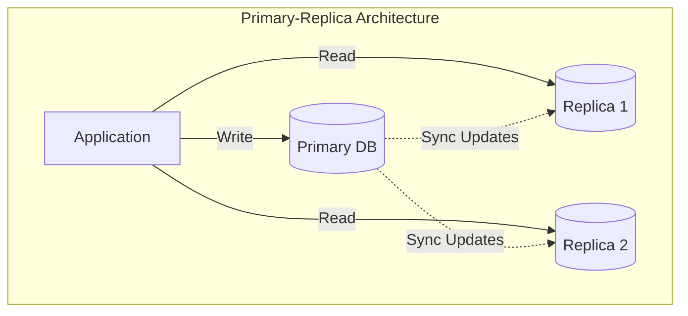
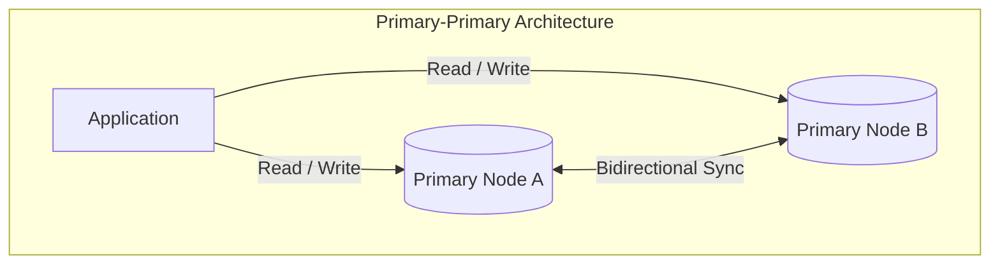

# Databases in System Design

Databases are a foundational component of any backend architecture, serving as the persistent layer where application data is reliably stored, managed, and retrieved. Selecting the right database technology is one of the most critical decisions in system design.

## Relational vs. Non-Relational Databases

When designing a system, the first major database decision is typically choosing between Relational (SQL) and Non-Relational (NoSQL) paradigms.

### Relational Databases (SQL)
Relational databases (e.g., PostgreSQL, MySQL) store data in highly structured tables with strict columns and rows.
* **Strict Schema:** They require a rigid, predefined schema. This ensures strong data integrity and consistency. However, modifying an incorrect schema later in the development lifecycle can be an expensive and complex operation.
* **Complex Queries:** They excel at complex queries and aggregations. Because the data structure and relationships are explicitly defined, the database engine can highly optimize data extraction, knowing exactly where specific data resides.

### Non-Relational Databases (NoSQL)
Non-Relational databases store data in flexible, unstructured formats. They offer a "loose" schema, adapting easily to changing requirements. To optimize read performance, NoSQL heavily relies on **denormalization** (duplicating and embedding data to avoid costly joins). 

There are four main families of NoSQL databases, each designed to solve specific architectural problems:

#### 1. Document Stores
* **Examples:** MongoDB, Couchbase.
* **Characteristics:** Store data as highly flexible JSON-like blobs. They do not require every document to have the exact same fields.
* **Use Cases:** Ideal for product catalogs, content management, or any collection where the structure naturally varies between items and lacks a strict schema.

#### 2. Key-Value Stores
* **Examples:** Redis, DynamoDB.
* **Characteristics:** Store simple key-value pairs. There is virtually no search penalty because data is directly indexed by the key.
* **Use Cases:** Extremely fast read operations. Perfect for caching layers, session storage, and real-time gaming leaderboards where sub-millisecond lookup latency is critical.

#### 3. Column Databases
* **Examples:** Cassandra, HBase.
* **Characteristics:** Organize data by columns rather than rows. They store similar data together (e.g., all "names" in a single continuous column block), making queries for specific fields extremely fast. They also efficiently compress repetitive values.
* **Use Cases:** Time-series data, high-velocity metric logging, and analytics workloads where you frequently query massive datasets for specific attributes.

#### 4. Graph Databases
* **Examples:** Neo4j, Amazon Neptune.
* **Characteristics:** Explicitly map relationships and connections (edges) between entities (nodes).
* **Use Cases:** Excel at problems requiring complex relationship analysis, such as social network friend graphs, recommendation engines, and fraud detection (identifying suspicious, interconnected transaction patterns).

## Database Scaling Strategies

How a database scales depends heavily on its underlying architecture and transactional guarantees.

* **Vertical Scaling (Relational):** Relational databases typically scale vertically (adding a larger CPU, more RAM, or faster disks to a single server). This is primarily due to their strict transactional nature. Distributing a relational load across multiple nodes while ensuring data consistency and avoiding write conflicts is exceptionally difficult.
* **Horizontal Scaling (Non-Relational):** Non-Relational databases are often designed from the ground up to scale horizontally (adding more commodity servers to a distributed cluster). Because they relax strict consistency rules, they can seamlessly shard data across many nodes.

### Partitioning vs. Sharding

When a database grows too large to perform efficiently, data must be divided. Two common techniques are partitioning and sharding, which are often confused but have a critical structural difference: physical location.

*   **Partitioning:** Slicing the data into smaller, more manageable pieces *on the same machine or database instance*. It is typically implemented before sharding because it's much simpler—there is no need to provision new hardware or manage network complexity between nodes. It directly improves query performance on a single server.
*   **Sharding:** Slicing the data and distributing it *across multiple independent machines or database instances*. Sharding implies a distributed architecture. It is implemented only after a single machine hits its absolute physical limits, adding significant operational complexity.

**The Shard Key**
When sharding, data is distributed based on a **Shard Key**—an arbitrary field chosen by the developer (e.g., User ID, Geographic Region). Selecting the correct shard key is critical. A poor choice leads to uneven data distribution (data skew), causing certain database clusters to become overloaded "hotspots" while others sit underutilized. For example, sharding by last name assumes names are evenly distributed across the alphabet, which is rarely true.

**Sharding Complexity:**
*   **NoSQL:** Databases like MongoDB are built to handle sharding natively and automatically, scaling horizontally as load increases.
*   **Relational (SQL):** Sharding must be manually engineered at the application layer, requiring careful planning to maintain transactional guarantees across disparate machines. Furthermore, complex queries that span multiple tables located on different shards suffer severe performance penalties due to network overhead.

## ACID Compliance

**ACID** is a set of properties that guarantee database transactions are processed reliably, forming the bedrock of relational database integrity.

* **A - Atomicity:** Guarantees that a transaction is treated as a single, indivisible "all or nothing" unit of work. If a transaction involves multiple distinct operations (e.g., one write and two reads), *all* operations must complete successfully. If any single operation fails, the entire transaction is immediately aborted and rolled back, leaving the database state entirely unchanged.
* **C - Consistency:** Ensures that a transaction can only bring the database from one valid state to another, adhering to all defined rules, constraints, and triggers.
* **I - Isolation:** Determines how transaction integrity is visible to other users and systems. It ensures that concurrent execution of transactions leaves the database in the same state as if they were executed sequentially.
* **D - Durability:** Guarantees that once a transaction has been committed, it will remain committed even in the case of a system failure (e.g., power loss or crash), typically by recording the transaction in a non-volatile log.

## Database Replication Architectures

When scaling databases, especially in read-heavy applications, replication is a crucial strategy. It involves maintaining multiple copies of the same data across different database nodes to improve availability, read throughput, and resilience.

### Primary-Replica (Master-Slave) Architecture

In a Primary-Replica setup, the system is strictly divided by responsibility:
*   **Primary Node:** A single, central database that receives *all* write operations.
*   **Replica Nodes:** One or more secondary databases that strictly handle read operations. They continuously pull updates from the primary to stay synchronized.

**Advantages:**
*   **Performance Isolation:** The primary advantage is drastically improved performance for read-heavy applications. The primary database isn't bogged down by complex read queries, allowing it to dedicate its resources to fast writes. Replicas handle the bulk of the application's read traffic.
*   **Failover Resilience:** If the primary node crashes, one of the replicas can be quickly promoted to become the new primary, minimizing downtime.

**The Consistency Trade-off:**
The critical challenge is that replicas are not guaranteed to be perfectly consistent with the primary at every given millisecond. The brief latency gap between a write occurring on the primary and that update propagating to the replicas means a client might read slightly stale data. In catastrophic failures where the primary dies mid-operation, some recent writes might not have replicated yet, introducing a risk of minor data loss.

### Primary-Primary (Master-Master) Architecture

In a Primary-Primary architecture, every node in the cluster is treated as a full primary. All servers can independently handle both read and write operations, continuously synchronizing data bidirectionally between themselves.

**Complexities & Conflict Resolution:**
The massive architectural complexity here is handling conflict resolution. When two different primary nodes receive conflicting writes for the exact same record simultaneously, the system must determine which write wins. This often requires complex vector clocks, conflict-free replicated data types (CRDTs), or a dedicated intermediary negotiation service to rectify the data before the final state is committed across all replicas.

## Replication Strategies

How data is actually synchronized between nodes significantly impacts system performance and consistency guarantees.

### Transactional Replication
In a transactional (or synchronous) replication strategy, strict consistency is prioritized above all else. 
*   **Mechanism:** A write operation to the primary is not considered complete until every single replica in the cluster has received the update, written it, and explicitly acknowledged the success back to the primary.
*   **Trade-off:** While it guarantees a highly consistent system with zero data loss, it severely degrades overall performance and availability. The entire system is only as fast as its slowest network link or database node, forcing the application to wait for total synchronization before proceeding.

### Snapshotting
Snapshotting is an asynchronous, periodic backup approach rather than a continuous stream of individual updates.
*   **Mechanism:** At scheduled intervals (e.g., hourly, daily), the system takes a complete, point-in-time "picture" of the database. However, this is not a literal visual image. It is an exact, serialized physical copy of all the underlying data files, tables, and records at that exact millisecond. This data dump is usually compressed into a massive file and stored in cheap, durable storage (like AWS S3).
*   **How it Works (Restoration):** You generally cannot run queries against a stored snapshot file directly. If the live database crashes or data is corrupted, you must *restore* the snapshot. To do this, you spin up a new, empty database server and instruct it to load the snapshot file. The database engine unpacks the file and completely rebuilds its internal state, effectively "time traveling" the database back to the exact moment the snapshot was taken. Once restoration is complete, it resumes functioning as a normal, live database.
*   **Advantages:** 
    *   **Cost-Effective & Low Impact:** It is computationally cheap because it's not a continuous, write-heavy process.
    *   **Resiliency:** It acts as a hard firewall against data corruption. If a bad write corrupts the live database, that corruption isn't instantly replicated; you have a guaranteed, pristine rollback point to the last known good state.
    *   **Global Distribution:** Snapshots can be easily distributed to data centers worldwide without the strict time pressure of real-time replication.
