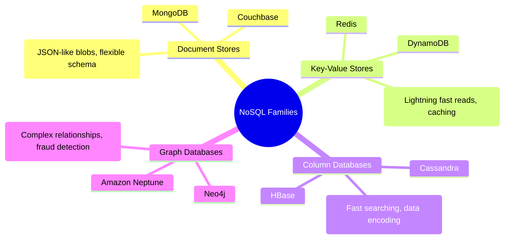
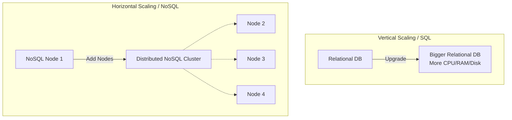

# Databases in System Design

Databases are a foundational component of any backend architecture, serving as the persistent layer where application data is reliably stored, managed, and retrieved. Selecting the right database technology is one of the most critical decisions in system design.

## Relational vs. Non-Relational Databases

When designing a system, the first major database decision is typically choosing between Relational (SQL) and Non-Relational (NoSQL) paradigms.

### Relational Databases (SQL)
Relational databases (e.g., PostgreSQL, MySQL) store data in highly structured tables with strict columns and rows.
* **Strict Schema:** They require a rigid, predefined schema. This ensures strong data integrity and consistency. However, modifying an incorrect schema later in the development lifecycle can be an expensive and complex operation.
* **Complex Queries:** They excel at complex queries and aggregations. Because the data structure and relationships are explicitly defined, the database engine can highly optimize data extraction, knowing exactly where specific data resides.

### Non-Relational Databases (NoSQL)
Non-Relational databases store data in flexible, unstructured formats. They offer a "loose" schema, adapting easily to changing requirements. To optimize read performance, NoSQL heavily relies on **denormalization** (duplicating and embedding data to avoid costly joins). 

There are four main families of NoSQL databases, each designed to solve specific architectural problems:

#### 1. Document Stores
* **Examples:** MongoDB, Couchbase.
* **Characteristics:** Store data as highly flexible JSON-like blobs. They do not require every document to have the exact same fields.
* **Use Cases:** Ideal for product catalogs, content management, or any collection where the structure naturally varies between items and lacks a strict schema.

#### 2. Key-Value Stores
* **Examples:** Redis, DynamoDB.
* **Characteristics:** Store simple key-value pairs. There is virtually no search penalty because data is directly indexed by the key.
* **Use Cases:** Extremely fast read operations. Perfect for caching layers, session storage, and real-time gaming leaderboards where sub-millisecond lookup latency is critical.

#### 3. Column Databases
* **Examples:** Cassandra, HBase.
* **Characteristics:** Organize data by columns rather than rows. They store similar data together (e.g., all "names" in a single continuous column block), making queries for specific fields extremely fast. They also efficiently compress repetitive values.
* **Use Cases:** Time-series data, high-velocity metric logging, and analytics workloads where you frequently query massive datasets for specific attributes.

#### 4. Graph Databases
* **Examples:** Neo4j, Amazon Neptune.
* **Characteristics:** Explicitly map relationships and connections (edges) between entities (nodes).
* **Use Cases:** Excel at problems requiring complex relationship analysis, such as social network friend graphs, recommendation engines, and fraud detection (identifying suspicious, interconnected transaction patterns).

## Database Scaling Strategies

How a database scales depends heavily on its underlying architecture and transactional guarantees.

* **Vertical Scaling (Relational):** Relational databases typically scale vertically (adding a larger CPU, more RAM, or faster disks to a single server). This is primarily due to their strict transactional nature. Distributing a relational load across multiple nodes while ensuring data consistency and avoiding write conflicts is exceptionally difficult.
* **Horizontal Scaling (Non-Relational):** Non-Relational databases are often designed from the ground up to scale horizontally (adding more commodity servers to a distributed cluster). Because they relax strict consistency rules, they can seamlessly shard data across many nodes.

## ACID Compliance

**ACID** is a set of properties that guarantee database transactions are processed reliably, forming the bedrock of relational database integrity.

* **A - Atomicity:** Guarantees that a transaction is treated as a single, indivisible "all or nothing" unit of work. If a transaction involves multiple distinct operations (e.g., one write and two reads), *all* operations must complete successfully. If any single operation fails, the entire transaction is immediately aborted and rolled back, leaving the database state entirely unchanged.
* **C - Consistency:** Ensures that a transaction can only bring the database from one valid state to another, adhering to all defined rules, constraints, and triggers.
* **I - Isolation:** Determines how transaction integrity is visible to other users and systems. It ensures that concurrent execution of transactions leaves the database in the same state as if they were executed sequentially.
* **D - Durability:** Guarantees that once a transaction has been committed, it will remain committed even in the case of a system failure (e.g., power loss or crash), typically by recording the transaction in a non-volatile log.
