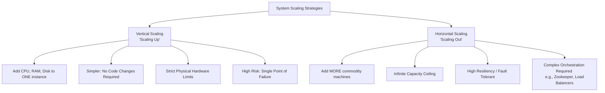

# Distributed Systems & Scaling

As an application's user base grows, a single standard server will inevitably fail to handle the incoming load. At this point, engineers must introduce scaling strategies, often leading to the architecture of a **Distributed System**—a system where multiple independent networked machines communicate and coordinate actions to appear as a single cohesive system to the end user.

## The Two Main Paradigms of Scaling

When a system needs more capacity to handle traffic, there are two fundamental directions to expand:

### 1. Vertical Scaling (Scaling Up)
Vertical scaling involves adding more raw, physical power to your existing servers. You upgrade the machine with more CPUs, RAM, GPUs, or faster solid-state drives.

*   **The Primary Advantage**: **Absolute Simplicity.** Vertical scaling typically requires **zero code changes** and no sweeping architectural shifts. You simply provision a larger, more expensive server instance, and your existing monolothic codebase runs faster.
*   **The Main Limitation**: **Physical Constraints.** There is a hard physical limit to how powerful a single machine can be. Once you've reached the ceiling of modern hardware capabilities, you simply cannot scale further.
*   **Resiliency Flaw (Single Point of Failure)**: Relying on a handful of massive servers introduces immense risk. If that one super-server suffers a hardware failure, your *entire* application goes offline. It represents a massive percentage of your total capacity in a single basket.

### 2. Horizontal Scaling (Scaling Out)
Horizontal scaling involves adding *more* standard machines to your resource pool and actively distributing the incoming traffic across them. 

*   **The Primary Advantage**: **Infinite Scale & Resiliency.** If you need more compute power, you just boot up 100 more commodity servers. Because the load is distributed, if one server catastrophically fails, the system easily survives because the rest of the pool picks up the slack (Fault Tolerance). **The Law of Availability**: It is vastly better to lose 1 server out of 100 than to lose 1 server out of 5.
*   **The Main Limitation**: **Architectural Complexity.** Horizontal scaling instantly transforms a simple application into a Distributed System. You now need sophisticated orchestration systems, load balancers, and distributed messaging software (like Apache ZooKeeper, Kafka, or Kubernetes) to ensure all the disparate machines stay synchronized.
*   **Why Default to Horizontal?**: Modern distributed systems typically build for horizontal scaling from day one. If you build a massive vertical monolith and try to transition to horizontal scaling later, you will face an immense code refactoring nightmare. In-memory method calls on a single machine must suddenly traverse a network as APIs (introducing latency, timeouts, and partial failures). Starting horizontal prevents this fundamental architectural rewrite.

## Scaling Taxonomy

