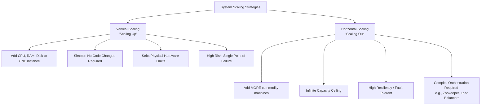
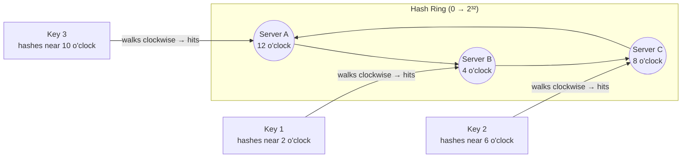

# Distributed Systems & Scaling

As an application's user base grows, a single standard server will inevitably fail to handle the incoming load. At this point, engineers must introduce scaling strategies, often leading to the architecture of a **Distributed System**—a system where multiple independent networked machines communicate and coordinate actions to appear as a single cohesive system to the end user.

## The Two Main Paradigms of Scaling

When a system needs more capacity to handle traffic, there are two fundamental directions to expand:

### 1. Vertical Scaling (Scaling Up)
Vertical scaling involves adding more raw, physical power to your existing servers. You upgrade the machine with more CPUs, RAM, GPUs, or faster solid-state drives.

*   **The Primary Advantage**: **Absolute Simplicity.** Vertical scaling typically requires **zero code changes** and no sweeping architectural shifts. You simply provision a larger, more expensive server instance, and your existing monolothic codebase runs faster.
*   **The Main Limitation**: **Physical Constraints.** There is a hard physical limit to how powerful a single machine can be. Once you've reached the ceiling of modern hardware capabilities, you simply cannot scale further.
*   **Resiliency Flaw (Single Point of Failure)**: Relying on a handful of massive servers introduces immense risk. If that one super-server suffers a hardware failure, your *entire* application goes offline. It represents a massive percentage of your total capacity in a single basket.

### 2. Horizontal Scaling (Scaling Out)
Horizontal scaling involves adding *more* standard machines to your resource pool and actively distributing the incoming traffic across them. 

*   **The Primary Advantage**: **Infinite Scale & Resiliency.** If you need more compute power, you just boot up 100 more commodity servers. Because the load is distributed, if one server catastrophically fails, the system easily survives because the rest of the pool picks up the slack (Fault Tolerance). **The Law of Availability**: It is vastly better to lose 1 server out of 100 than to lose 1 server out of 5.
*   **The Main Limitation**: **Architectural Complexity.** Horizontal scaling instantly transforms a simple application into a Distributed System. You now need sophisticated orchestration systems, load balancers, and distributed messaging software (like Apache ZooKeeper, Kafka, or Kubernetes) to ensure all the disparate machines stay synchronized.
*   **Why Default to Horizontal?**: Modern distributed systems typically build for horizontal scaling from day one. If you build a massive vertical monolith and try to transition to horizontal scaling later, you will face an immense code refactoring nightmare. In-memory method calls on a single machine must suddenly traverse a network as APIs (introducing latency, timeouts, and partial failures). Starting horizontal prevents this fundamental architectural rewrite.

## Scaling Taxonomy

## Consistent Hashing

When you have a cluster of servers (cache nodes, database shards) and need to distribute keys across them, a naive approach like `hash(key) % num_servers` breaks catastrophically when you add or remove a server — almost every key remaps to a different server, invalidating your entire cache or requiring massive data reshuffling.

**Consistent Hashing** solves this by mapping both keys and servers onto a conceptual "ring" (a fixed 0–2³² range). Each server occupies one or more positions on the ring. To find which server holds a key, you hash the key and walk clockwise around the ring until you hit a server node.

**Why Consistent Hashing is Powerful:**
- When a server is added, **only** the keys between the new node and its predecessor on the ring need to be remapped. All other keys are unaffected.
- When a server is removed, only that server's keys remap to the next server clockwise. The rest of the ring is stable.
- **Virtual Nodes:** To ensure even distribution even with heterogeneous hardware, each physical server can occupy multiple positions on the ring (virtual nodes). A more powerful server can have more virtual nodes, absorbing proportionally more traffic.

**Where it appears:**
- **Distributed caches:** Memcached clusters, Redis Cluster.
- **Database sharding:** Determining which shard owns a given row.
- **Load balancing:** Sticky sessions (ensuring the same user always goes to the same server).

---

## Fault Tolerance & Replication

A single machine will eventually fail. Distributed systems achieve resilience through **replication** — keeping multiple copies of data on independent machines so the system survives individual failures.

### Replication Topologies

| Model | Description | Trade-off |
|:---|:---|:---|
| **Primary-Replica** | One primary accepts all writes; replicas serve reads | Simple, but primary is a SPOF without failover |
| **Primary-Primary** | Multiple nodes accept writes; must resolve conflicts | Higher availability, but complex conflict resolution |
| **Leaderless** | Any node accepts writes; uses quorums for consistency | Maximum availability, eventual consistency |

### Quorums (W + R > N)

In distributed systems with N replicas, you configure:
- **W** = minimum nodes that must confirm a write
- **R** = minimum nodes that must respond to a read

**Rule:** `W + R > N` guarantees you will always read at least one node that has the latest write (overlap exists).

| Config | Behavior | Use Case |
|:---|:---|:---|
| W=N, R=1 | Strong write consistency, fast reads | Write-once data |
| W=1, R=N | Fast writes, strong read consistency | Read-heavy systems |
| W=N/2+1, R=N/2+1 | Balanced consistency | General purpose |

---

## Key Interview Insight on Distributed Systems

> **The hardest problems in distributed systems are not technical — they are definitional.** The question "is this system consistent?" requires you to first define *which consistency model* you are targeting (strong, eventual, read-your-writes, monotonic read, etc.), and *under which failure conditions* (network partition? node crash? message delay?). Interviewers who ask about consistency are really testing whether you know that consistency is a spectrum, not a binary property.
