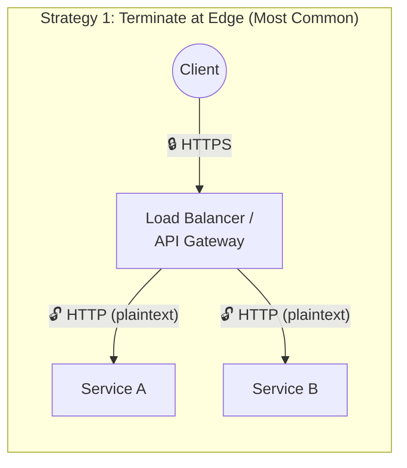
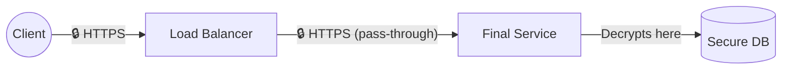
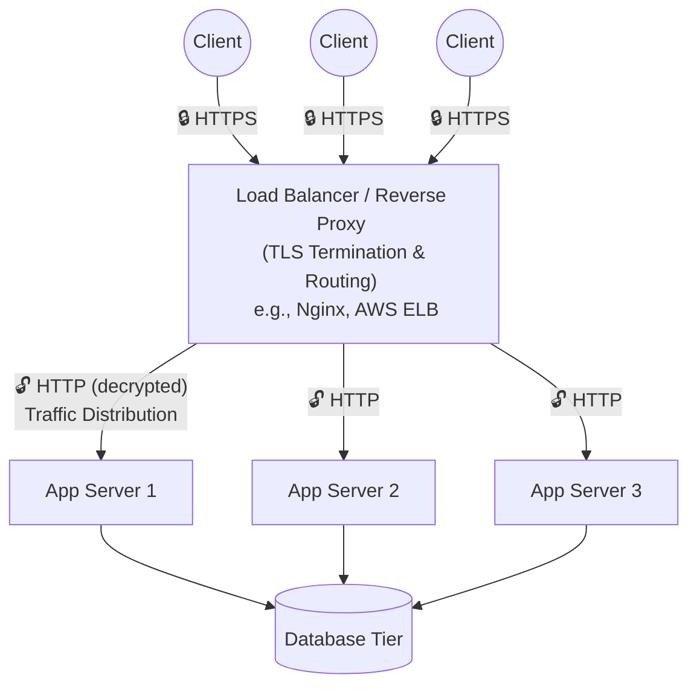

# Load Balancing & Reverse Proxies

When you scale a simple application from one server to multiple servers (Horizontal Scaling), a new fundamental challenge arises: **How does the client know which server to connect to?**

If a client application had to manage a list of 100 server IP addresses, handle real-time DNS updates, and manually detect which servers were offline, the system would be impossibly fragile. 

This introduces the necessity of a critical intermediary component: **The Load Balancer**.

## What is a Load Balancer?

A load balancer is a specialized service or server that sits directly between the client and your pool of backend servers. It accepts incoming network traffic and intelligently distributes it across the available servers.

*   **Traffic Distribution**: Ensures no single server is overwhelmingly saturated, maximizing throughput and minimizing response time.
*   **Auto-Scaling**: Makes it easy to seamlessly add or remove servers from the active pool without the client ever knowing the internal topology has changed.
*   **Health Checks**: Actively monitors the "health" of backend servers. If a server crashes or hangs, the load balancer stops sending it traffic until it successfully recovers.
*   **Placement (Edge vs. Internal)**: While the primary load balancer is typically placed at the "edge" of a system to distribute incoming public/client traffic across web servers, internal load balancers can also be positioned deep within the architecture (e.g., in front of multiple active databases) to solve internal cluster distribution problems.

## Reverse Proxy vs. Load Balancer

In system design discussions, you will frequently hear the terms "Reverse Proxy" and "Load Balancer" used interchangeably. While their functions heavily overlap, there is a technical distinction in their core purpose:

*   **Dedicated Load Balancer**: Primarily focused purely on distributing massive volumes of traffic. At immense scale, you might use a dedicated hardware load balancer or a highly optimized cloud backbone service like Amazon Elastic Load Balancing (AWS ELB).
*   **Reverse Proxy**: Software like **Nginx** or **HAProxy** that *can* perform load balancing beautifully, but also handles deeply integrated application-level features. These features are why reverse proxies generally offer more overall flexibility:
    *   **HTTPS Termination**: Decrypting secure traffic at the edge so backend servers don't have to spend expensive CPU cycles doing it.
    *   **Route-Based Routing**: Deeply inspecting the request and routing `/images` traffic to an optimized image server and `/api/transactions` traffic to a highly secure internal API server.
    *   **Caching**: Serving common static content directly without ever hitting the backend server.

For most modern web architectures, a Reverse Proxy operates *as* the Load Balancer.

## SSL/TLS Termination — Where Encryption Ends

When clients connect to your system over HTTPS, their requests are encrypted. But encrypted data cannot be inspected, routed, or processed without first being decrypted. **SSL/TLS Termination** is the act of decrypting that encrypted traffic at a specific point in your infrastructure, so the rest of the system can work with plain HTTP internally.

### Why Terminate at All?

Think of HTTPS as an armored car transporting cash. The armored car (encryption) protects the cash (data) on dangerous public roads (the internet). But once the cash arrives at the secure bank vault (your internal network), you don't keep it in the armored car forever — you unload it so tellers can count it, sort it, and process it efficiently.

Maintaining encryption throughout the *entire* internal request path would mean every single server, cache, and service along the way must:
1.  Possess the SSL certificate and private key (a massive security risk if widely distributed).
2.  Spend CPU cycles on decryption just to inspect whether the request is even relevant to them.
3.  Re-encrypt the data before forwarding it to the next hop.

All cryptography is **computationally expensive by design** — that's precisely what makes encryption algorithms like AES-256 difficult to break. While the cost of a single encrypt/decrypt cycle is negligible, at millions of requests per second the aggregate overhead becomes a significant performance bottleneck.

### The Three Termination Strategies

**Strategy 1 — Terminate at the Load Balancer / API Gateway (Most Common)**
*   The load balancer or reverse proxy holds the SSL certificate and decrypts all incoming traffic at the edge.
*   Internal services receive plain HTTP, saving them from expensive decryption work.
*   **Best for:** The vast majority of applications where the internal network is trusted and performance matters.

---

**Strategy 2 — End-to-End Encryption (Pass-Through Termination)**

*   The load balancer does **not** decrypt the traffic. It blindly proxies the still-encrypted request all the way through to the final destination service, which holds the certificate and decrypts it.
*   No intermediate service can read or tamper with the data in transit.
*   **Best for:** Highly sensitive data requiring regulatory compliance — **HIPAA** (healthcare), **PCI-DSS** (financial/banking transactions), or government systems where even internal network segments are considered hostile.

---

**Strategy 3 — Terminate, Inspect, and Re-Encrypt**
*   The load balancer decrypts the traffic, inspects or routes it, and then **re-encrypts** it before forwarding to the appropriate backend service.
*   This gives you the routing intelligence of Strategy 1 with the internal security guarantees closer to Strategy 2.
*   **Best for:** Uncommon edge cases where you need intelligent routing *and* internal encryption. This is the most computationally expensive approach because every hop involves a full decrypt → inspect → re-encrypt cycle.

### The Logging Trap: A Hidden Security Risk

When SSL/TLS is terminated early (Strategy 1), all downstream services handle **unencrypted data**. This creates a subtle but critical vulnerability through **logging services**.

Most production systems automatically log request payloads for debugging and monitoring. If those payloads contain sensitive information (passwords, credit card numbers, personal health data), the log database ends up storing a massive, unencrypted dump of private data that is broadly accessible to engineers and operations staff.

**Mitigation strategies:**
*   **Log scrubbing:** Automatically strip or mask sensitive fields (e.g., replacing credit card numbers with `****-****-****-1234`) before writing to logs.
*   **Structured logging policies:** Define strict allowlists of fields that *may* be logged, rather than logging entire request bodies.
*   **Encryption at rest:** Encrypt log storage itself so that even if logs contain sensitive data, they are protected on disk.
*   **Access controls:** Restrict who can query production logs and audit all access.

## The Bottleneck Shift

A critical phenomenon to watch out for when adding load balancers is the **Bottleneck Shift**. 

When scaling a simple application from one application server to three application servers, beginners often expect total performance to perfectly triple. However, an unexpected bottleneck often violently reveals itself: **The Database**. 

What was previously masked by the single initial server's limited compute capacity is now unbottlenecked, pushing all of that accumulated traffic downstream. The database, which was previously doing fine, is now the actual performance constraint. Solving one scaling bottleneck almost always shifts the overwhelming pressure to the next downstream resource.

## Simple Load Balanced Architecture

