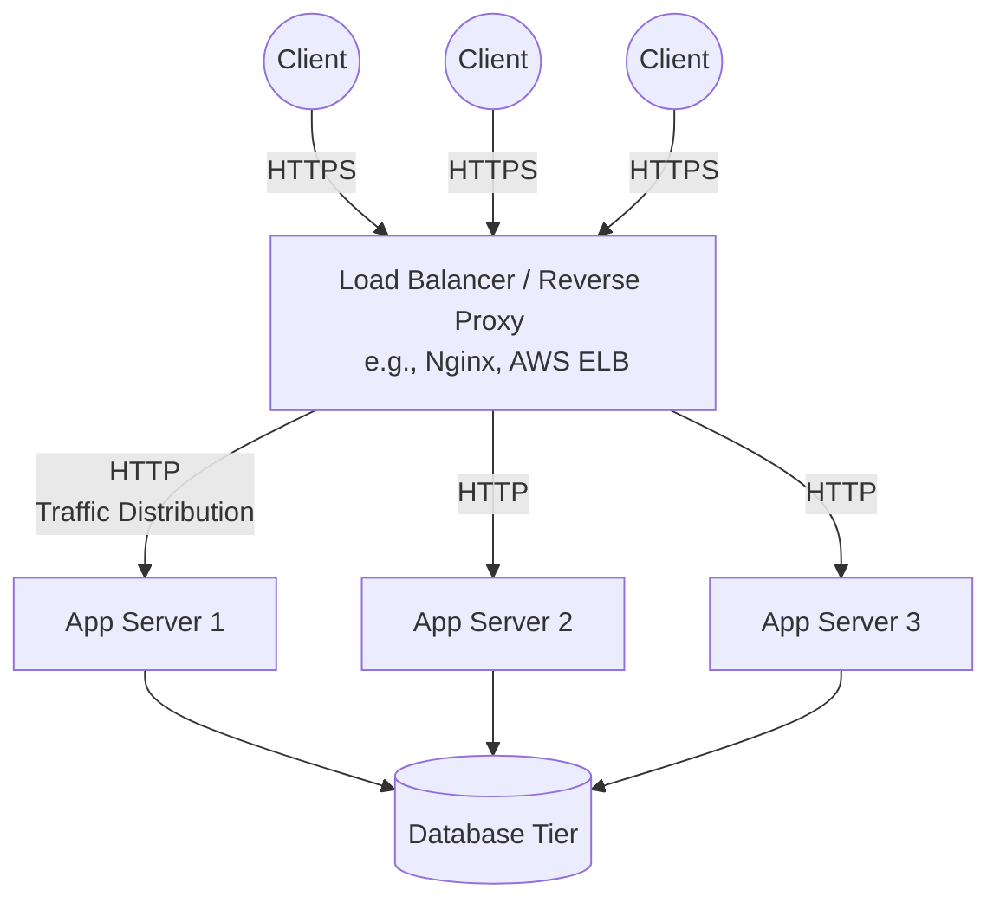

# Load Balancing & Reverse Proxies

When you scale a simple application from one server to multiple servers (Horizontal Scaling), a new fundamental challenge arises: **How does the client know which server to connect to?**

If a client application had to manage a list of 100 server IP addresses, handle real-time DNS updates, and manually detect which servers were offline, the system would be impossibly fragile. 

This introduces the necessity of a critical intermediary component: **The Load Balancer**.

## What is a Load Balancer?

A load balancer is a specialized service or server that sits directly between the client and your pool of backend servers. It accepts incoming network traffic and intelligently distributes it across the available servers.

*   **Traffic Distribution**: Ensures no single server is overwhelmingly saturated, maximizing throughput and minimizing response time.
*   **Auto-Scaling**: Makes it easy to seamlessly add or remove servers from the active pool without the client ever knowing the internal topology has changed.
*   **Health Checks**: Actively monitors the "health" of backend servers. If a server crashes or hangs, the load balancer stops sending it traffic until it successfully recovers.
*   **Placement (Edge vs. Internal)**: While the primary load balancer is typically placed at the "edge" of a system to distribute incoming public/client traffic across web servers, internal load balancers can also be positioned deep within the architecture (e.g., in front of multiple active databases) to solve internal cluster distribution problems.

## Reverse Proxy vs. Load Balancer

In system design discussions, you will frequently hear the terms "Reverse Proxy" and "Load Balancer" used interchangeably. While their functions heavily overlap, there is a technical distinction in their core purpose:

*   **Dedicated Load Balancer**: Primarily focused purely on distributing massive volumes of traffic. At immense scale, you might use a dedicated hardware load balancer or a highly optimized cloud backbone service like Amazon Elastic Load Balancing (AWS ELB).
*   **Reverse Proxy**: Software like **Nginx** or **HAProxy** that *can* perform load balancing beautifully, but also handles deeply integrated application-level features. These features are why reverse proxies generally offer more overall flexibility:
    *   **HTTPS Termination**: Decrypting secure traffic at the edge so backend servers don't have to spend expensive CPU cycles doing it.
    *   **Route-Based Routing**: Deeply inspecting the request and routing `/images` traffic to an optimized image server and `/api/transactions` traffic to a highly secure internal API server.
    *   **Caching**: Serving common static content directly without ever hitting the backend server.

For most modern web architectures, a Reverse Proxy operates *as* the Load Balancer.

## The Bottleneck Shift

A critical phenomenon to watch out for when adding load balancers is the **Bottleneck Shift**. 

When scaling a simple application from one application server to three application servers, beginners often expect total performance to perfectly triple. However, an unexpected bottleneck often violently reveals itself: **The Database**. 

What was previously masked by the single initial server's limited compute capacity is now unbottlenecked, pushing all of that accumulated traffic downstream. The database, which was previously doing fine, is now the actual performance constraint. Solving one scaling bottleneck almost always shifts the overwhelming pressure to the next downstream resource.

## Simple Load Balanced Architecture

