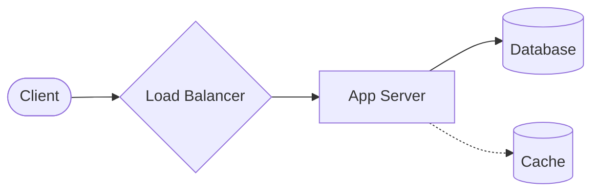

# System Design Interview Approach

A structured framework is critical in a system design interview. It prevents you from getting lost in details too early and ensures you address the core problem. Use this template as your 45-minute roadmap.

## 1. Clarification & Scoping (5–10 min)
***Never start designing immediately.*** Ask questions to understand exactly what the interviewer wants you to build and set boundaries.
- **Functional Requirements**: What are the core features? *(e.g., "Users can upload a video" vs "Users can view a timeline")*
- **Non-Functional Requirements**: What is the scale? *(e.g., 100k Daily Active Users? High Read-to-Write ratio?)* Are we prioritizing High Availability or Strong Consistency?
- **Out of Scope**: What are we *not* building? *(e.g., "Let's agree to ignore the payment gateway and authentication for today.")*

## 2. Define Core Entities & APIs (5 min)
Identify the primary nouns of the system to define the data model and the APIs that external clients will consume.
- **Entities**: User, Video, Comment.
- **APIs**: `createPost(userId, media)`, `getFeed(userId, paginationOffset)`. 

## 3. High-Level Architecture (10–15 min)
Draw the 'happy path' architecture. Connect the client to your backend services solving the core requirement without worrying about scaling to millions of users just yet.

*(Hint: Narrate your thought process out loud as you draw. "The client hits our Load Balancer, which securely routes traffic to our App Servers...")*

## 4. Deep Dive (10–15 min)
Once the interviewer agrees with the high-level design, zoom in on the most unique or challenging part of the system. Let the interviewer guide where you focus.
- **Data Storage**: Justify choosing SQL vs NoSQL. Sketch the exact tables or document structures.
- **Scaling Bottlenecks**: Add asynchronous Message Queues (Kafka) for heavy background tasks. Add a CDN for static assets like images and videos.
- **Data Partitioning**: How do we shard the database across multiple machines if a single hard drive fills up?

## 5. Tradeoffs & Bottlenecks (5 min)
Acknowledge the compromises in your design.
- **CAP Theorem**: *"We chose eventual consistency (AP) for the news feed because pure availability is more important than immediate consistency. Users won't notice a 2-second delay."*
- **Cost vs Complexity**: *"We could use Redis to cache every single query, but that drastically increases infrastructure cost for marginal speed gains."*
- **Single Points of Failure (SPOF)**: Identify what happens if the Master DB goes offline.

## Key Insight
**Treat the interviewer as a teammate.** A system design interview is a collaborative session. If you get stuck, explain the options you are debating. E.g., *"I'm debating between using a relational DB for rigid schema vs NoSQL for fast reads. Given our requirements, I think NoSQL fits better. Does that align with your expectations?"*

## Interview Tip
**Pacing and time management.** If you spend 25 minutes drawing out the perfect database schema, you will run out of time to discuss the overall architecture and fail. Practice moving through these phases on a 45-minute timer.