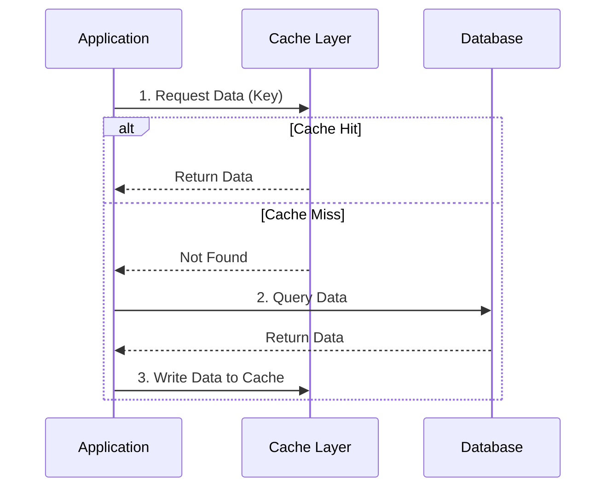
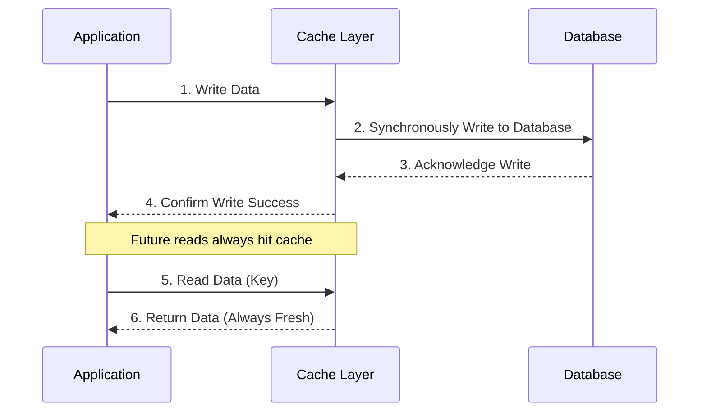
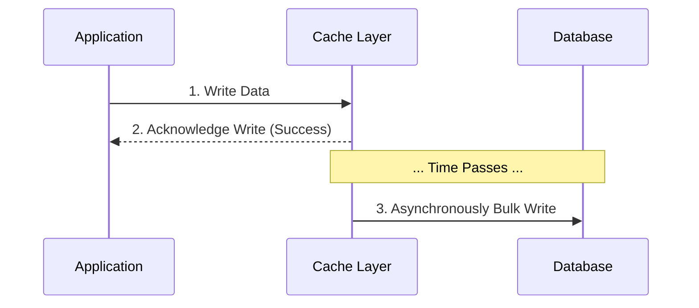
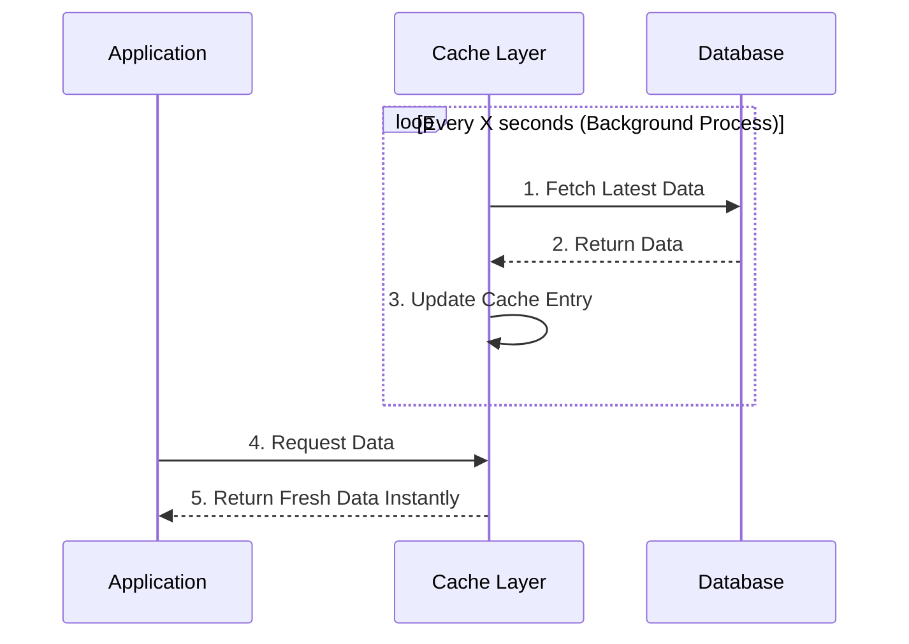

# Caching Patterns & Strategies

When introducing a cache, you must decide *how* and *when* data is written to and read from it. These decisions are known as caching strategies.

## Cache-Aside (Lazy Loading)

Cache-Aside is the most common and generally recommended caching strategy. It is "lazy" because data is only loaded into the cache when it is actually requested.

**Workflow:**
1.  **Check Cache:** The application first checks the cache for the requested data.
2.  **Cache Hit / Miss:** If found (hit), the data is returned immediately. If not found (miss), the application queries the primary database.
3.  **Update Cache:** The application returns the data from the database to the user, and then writes that same data into the cache for future requests.

**Advantages:**
*   Only heavily requested data occupies valuable cache space.
*   If the cache cluster fails, the system can still function (albeit slower) by falling back to the database.

## Write-Through Caching

In Write-Through, every write operation goes to the cache and the database simultaneously. The cache is always kept in sync with the database — no data is ever "only in the cache."

**Workflow:**
1.  **Write to Cache:** The application sends the write to the cache layer.
2.  **Synchronous DB Write:** The cache synchronously writes the data to the primary database *before* acknowledging success.
3.  **Confirmation:** Only after the database confirms the write does the cache return success to the application.

**Trade-offs:**
*   **Advantage (Consistency):** The cache is always in sync with the database. Cache hits always return the most up-to-date data, eliminating stale-read problems. This is ideal for read-heavy systems where freshness is critical.
*   **Disadvantage (Write Latency):** Every write must wait for both the cache write and the database write to complete. This makes individual write operations slower than Cache-Aside or Write-Behind.
*   **Disadvantage (Cache Pollution):** Data is written to the cache regardless of whether it will ever be read again. This can waste precious cache memory on data that has low read frequency.

**Best For:** Financial dashboards, user profile pages, or any scenario where the data is frequently written *and* frequently read, and stale reads are unacceptable.

## Write-Behind (Write-Back) Caching

In a Write-Behind strategy, the application treats the cache as the primary data store for writes.

**Workflow:**
1.  **Write to Cache:** The application writes the update directly to the cache.
2.  **Immediate Return:** The cache immediately confirms the write to the application, allowing the user to proceed instantly.
3.  **Async Database Sync:** Behind the scenes, the cache asynchronously flushes those writes to the primary database at a later time (often in batches).

**Trade-offs:**
*   **Advantage:** Extremely high write performance and availability. The application never waits for slow database disk writes.
*   **Disadvantage (Consistency Risk):** If the cache server crashes before it has successfully synchronized its data with the main database, any acknowledged but un-synced writes are permanently lost. Consistency is strictly eventually consistent.

## Refresh-Ahead

Refresh-ahead is a proactive cache invalidation and loading strategy where the system is designed to automatically update the cache periodically *before* the data actually expires or is requested. 

**Workflow:**
1.  **Background Sync:** A background worker or daemon process continuously monitors cache entries.
2.  **Proactive Fetch:** Just before an item's TTL expires, the process reaches out to the database to fetch the most up-to-date value.
3.  **Silent Update:** The cache is updated seamlessly in the background. When the application reads from the cache, it always receives extremely fast, relatively fresh data without ever triggering a slow database fetch on a cache miss.

**Trade-offs:**
*   **Advantage:** Zero read latency for the application because cache misses are virtually eliminated for frequently accessed items.
*   **Disadvantage:** Can waste significant network bandwidth and database resources by continuously refreshing data that might not ever be requested again by the application.

---

## Caching Strategy Comparison

| Strategy | Write Latency | Read Latency | Consistency | Data Loss Risk | Best For |
|:---|:---:|:---:|:---:|:---:|:---|
| **Cache-Aside** | Low (no cache write) | High on first miss | Eventual | None | General purpose, read-heavy |
| **Write-Through** | High (waits for DB) | Always low | Strong | None | Read-heavy + freshness critical |
| **Write-Behind** | Very Low (async) | Low | Eventual | Yes (if crash) | High-velocity writes (analytics, logging) |
| **Refresh-Ahead** | N/A (background) | Always low | Near-real-time | None | Predictable, frequently-accessed data |
