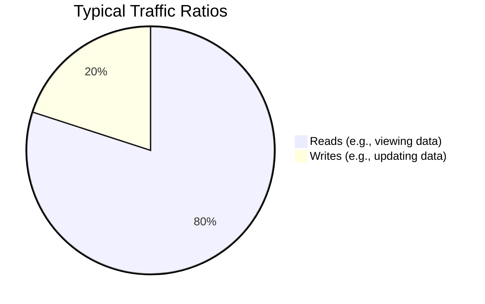
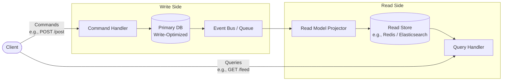
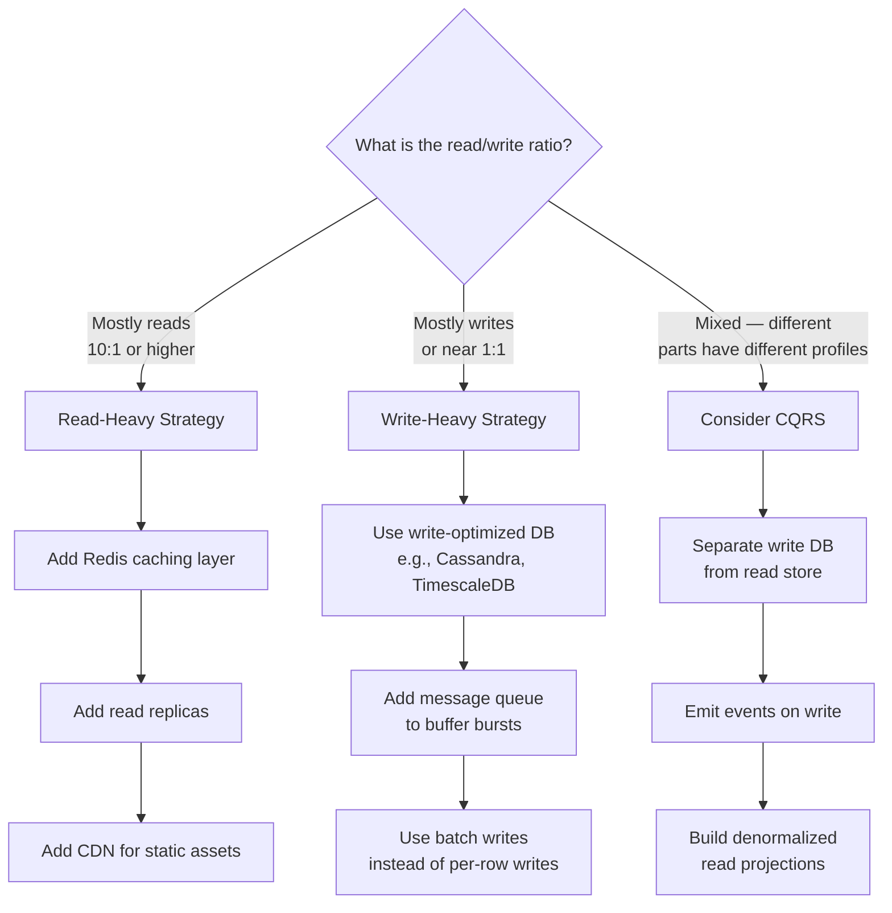

# Read-Heavy vs. Write-Heavy Systems

Understanding the ratio of reads to writes in your system is fundamental to shaping your architecture, choosing your database, and designing your caching strategy. 

## Distinguishing the Ratio

*Note: The exact ratio varies heavily by domain, but most applications are strongly read-heavy with typical ratios ranging from 10:1 to 1000:1 (reads to writes).*

**Q: Why is it important to distinguish between read and write transactions when determining non-functional requirements?**
A: Different systems have vastly different operational profiles. For example, banking applications or social media feeds are typically **read-heavy** (users check their balances/transaction history far more frequently than they transfer money or make payments). 
Understanding this ratio is crucial because it helps determine:
1. **Appropriate System Architecture**: e.g., separating read and write database nodes.
2. **Caching Strategies**: Heavy read traffic often demands layered caching to protect the primary database and speed up responses.
3. **Resource Allocation**: You can scale out read replicas to handle high read loads horizontally without paying for expensive write-capable master nodes.

## System Profiles

### Read-Heavy Systems
- **Examples**: 
  - **Social media** (where users mostly scroll, e.g., Twitter feeds or YouTube).
  - **Package managers** like `npm` (where most users download packages rather than publish).
  - **Data warehouses** and Banking apps (checking balances).
- **Optimization Strategy**: 
  - Substantial caching layers.
  - Database read-replicas.
  - Content Delivery Networks (CDNs) for static assets.

### Write-Heavy Systems
- **Examples**: 
  - **Logging systems** and metric collection.
  - **Eventing systems**.
  - IoT telemetry ingestion and click-tracking.
- **Optimization Strategy**:
  - Write-optimized databases (e.g., Cassandra, Time-series databases).
  - Message queues or event streams (Kafka) to buffer high-velocity write bursts.
  - Batch processing instead of single real-time writes when possible.

---

## Mixed Systems: CQRS (Command Query Responsibility Segregation)

Many real-world systems are neither purely read-heavy nor purely write-heavy — different parts of the system have radically different operational profiles. For example, a social network's feed-reading path is extremely read-heavy, but its notification-writing path is extremely write-heavy.

**CQRS** is an architectural pattern that explicitly separates the *read model* from the *write model*, allowing each to be optimized independently.

**How CQRS Works:**
1.  **Commands (Writes):** Mutations go to the write model — a normalized, ACID-compliant database optimized for correctness.
2.  **Events:** The write model emits events (e.g., "PostCreated", "UserFollowed") to an event bus.
3.  **Projections:** A projector service consumes events and maintains a denormalized *read model* optimized for the specific queries clients need (e.g., a pre-aggregated feed).
4.  **Queries (Reads):** Reads hit the read model directly — no joins, no complex aggregations at query time. Reads are fast because the work is pre-computed.

**Trade-offs:**
*   **Advantage:** Extreme scalability for both reads and writes independently. The read model can be a Redis cache, Elasticsearch index, or a denormalized replica — whatever serves the query pattern best.
*   **Disadvantage:** Eventual consistency between write and read models. After writing, the read model may be stale for a brief period while the event propagates. This is acceptable for most social features (e.g., a feed showing a post 1 second late is fine) but unacceptable for financial systems (e.g., a balance update must be immediately reflected).

**When to use CQRS:**
- The read and write models have fundamentally different optimization requirements.
- Query complexity is high (many aggregations, joins) on a write-optimized schema.
- The system has very high read throughput requirements that the write DB cannot handle.

---

## Architecture Selection Guide

Use this flowchart to choose your optimization strategy:

