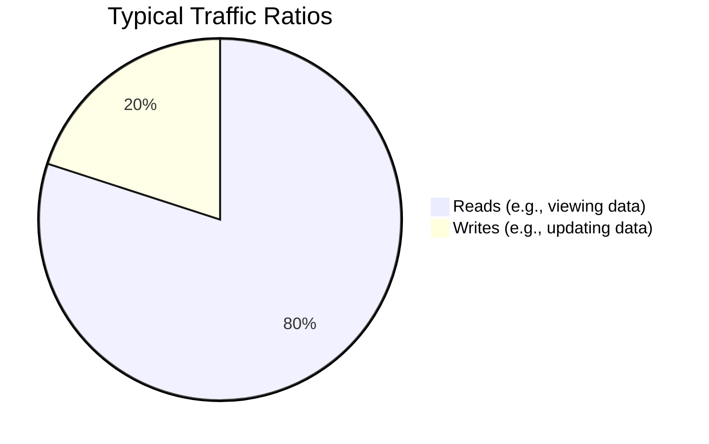

# Read-Heavy vs. Write-Heavy Systems

Understanding the ratio of reads to writes in your system is fundamental to shaping your architecture, choosing your database, and designing your caching strategy. 

## Distinguishing the Ratio

*Note: The exact ratio varies heavily by domain, but most applications are strongly read-heavy with typical ratios ranging from 10:1 to 1000:1 (reads to writes).*

**Q: Why is it important to distinguish between read and write transactions when determining non-functional requirements?**
A: Different systems have vastly different operational profiles. For example, banking applications or social media feeds are typically **read-heavy** (users check their balances/transaction history far more frequently than they transfer money or make payments). 
Understanding this ratio is crucial because it helps determine:
1. **Appropriate System Architecture**: e.g., separating read and write database nodes.
2. **Caching Strategies**: Heavy read traffic often demands layered caching to protect the primary database and speed up responses.
3. **Resource Allocation**: You can scale out read replicas to handle high read loads horizontally without paying for expensive write-capable master nodes.

## System Profiles

### Read-Heavy Systems
- **Examples**: 
  - **Social media** (where users mostly scroll, e.g., Twitter feeds or YouTube).
  - **Package managers** like `npm` (where most users download packages rather than publish).
  - **Data warehouses** and Banking apps (checking balances).
- **Optimization Strategy**: 
  - Substantial caching layers.
  - Database read-replicas.
  - Content Delivery Networks (CDNs) for static assets.

### Write-Heavy Systems
- **Examples**: 
  - **Logging systems** and metric collection.
  - **Eventing systems**.
  - IoT telemetry ingestion and click-tracking.
- **Optimization Strategy**:
  - Write-optimized databases (e.g., Cassandra, Time-series databases).
  - Message queues or event streams (Kafka) to buffer high-velocity write bursts.
  - Batch processing instead of single real-time writes when possible.
