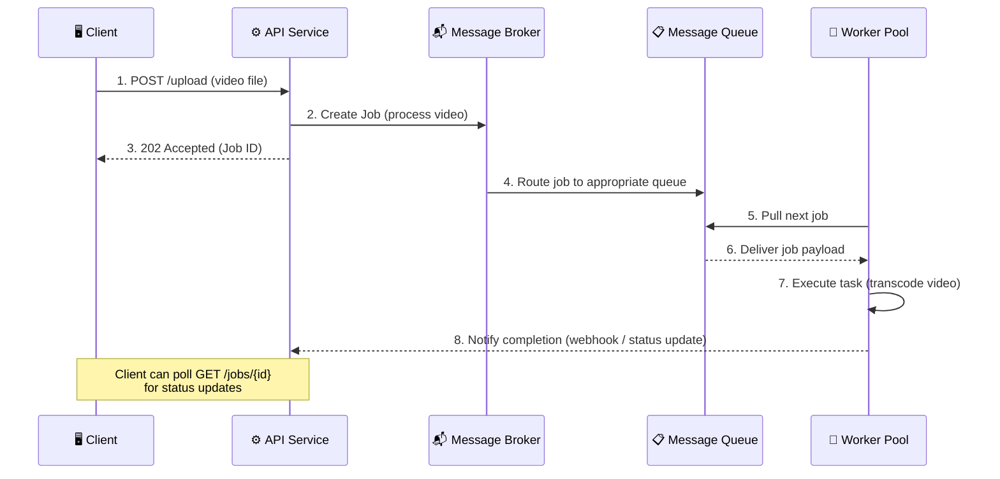
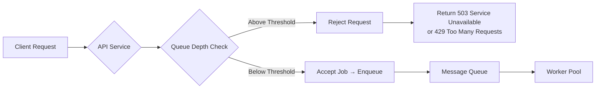
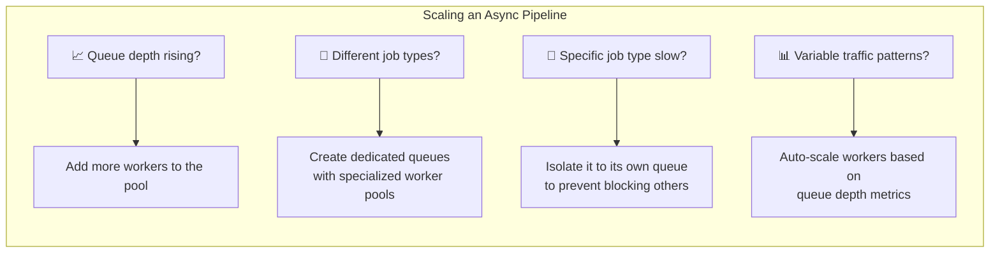

# System Flow Patterns

This document explores the architectural patterns that govern how work moves through a system — from synchronous request-response cycles to asynchronous job processing pipelines. Understanding these flow patterns is essential for designing systems that remain responsive and resilient under heavy computational load.

---

## Asynchronous Workflow Architecture

Not every operation can — or should — complete within the lifetime of a single HTTP request. When a user uploads a video, generates a PDF report, or kicks off an LLM inference, forcing them to wait for a synchronous response would block the server thread, degrade system availability, and deliver a miserable user experience. **Asynchronous workflows** solve this by decoupling the *acceptance* of work from the *execution* of work.

### Core Components

An asynchronous workflow is composed of four cooperating components, each with a distinct responsibility:

| Component | Responsibility |
| :--- | :--- |
| **Service / API Server** | Receives the client request, validates it, and creates a **job** — a structured message describing the work to be done. The service returns an immediate acknowledgment to the client (e.g., `202 Accepted`) without waiting for the job to finish. |
| **Message Broker** | The central nervous system of the async pipeline. It receives jobs from services, routes them intelligently, and manages the lifecycle of one or more queues. Examples: **RabbitMQ**, **Apache Kafka**, **Amazon SQS**. |
| **Message Queue(s)** | Durable, ordered buffers that hold jobs in line until a worker becomes available. Queues decouple producers (services) from consumers (workers), meaning neither needs to know about the other's existence or availability. |
| **Worker Pool** | A fleet of background processes that continuously pull jobs from the queue and execute them. Workers are stateless and independently scalable — you can spin up more workers when the queue depth grows and scale them down when it shrinks. |

### Architectural Flow

The critical insight is the **immediate decoupling** at step 3: the client receives a response in milliseconds, while the actual computation (which may take minutes) happens entirely in the background. The client can poll for status, receive a webhook callback, or be notified via SSE when the job completes.

---

### Back Pressure

In any producer-consumer system, there is an inherent risk that producers generate work faster than consumers can process it. Left unchecked, queues grow unboundedly, memory is exhausted, and the entire system crashes. **Back pressure** is the mechanism that prevents this collapse.

When queue depth exceeds a configured threshold, the system applies back pressure by signaling upstream components to slow down or stop accepting new work:

**How back pressure manifests in practice:**

*   **Queue-level limits:** The message broker enforces a maximum queue size. Once reached, new publish attempts are rejected, and the service must handle the rejection gracefully.
*   **Service-level throttling:** The API service monitors queue depth metrics and proactively stops accepting new jobs before the queue physically fills up, returning `503 Service Unavailable` or `429 Too Many Requests` to clients.
*   **Client-side retry logic:** Well-designed clients interpret these responses as a signal to back off — typically using **exponential backoff with jitter** — rather than hammering the service with retries.

> **Key Principle:** Back pressure is not a failure mode — it is a *safety valve*. A system that gracefully degrades under load (rejecting excess work temporarily) is far more resilient than one that silently accepts unbounded work until it collapses entirely.

---

### Ideal Use Cases for Async Workflows

Asynchronous processing is warranted when a task is **computationally expensive**, **time-consuming**, or **non-interactive** — meaning the user does not need an immediate result to continue their workflow.

| Use Case | Why Async? |
| :--- | :--- |
| Video upload & transcoding | Transcoding a single video can consume minutes of CPU time. Blocking the upload endpoint would exhaust server threads. |
| Image processing & thumbnails | Resizing, cropping, and applying filters are CPU-bound operations that scale linearly with resolution. |
| Report / PDF generation | Aggregating data, rendering layouts, and compressing files are memory-intensive and unpredictable in duration. |
| Payment processing | External payment gateway calls involve network latency, retries, and fraud verification — all of which are slow and unreliable. |
| LLM inference & AI generation | Large model inference can take seconds to minutes depending on model size and input complexity. |
| Archive / ZIP preparation | Collecting, compressing, and staging files for download is I/O-bound and can involve gigabytes of data. |
| Email & notification dispatch | Sending emails through external SMTP providers involves network I/O and rate limits that should never block the main request path. |

---

### Scaling Characteristics

One of the most powerful properties of asynchronous architectures is the **granular, independent scalability** of each component:

*   **Horizontal worker scaling:** Workers are stateless consumers. Scaling them is as simple as launching more instances — there is no session migration or state synchronization required.
*   **Queue specialization:** You can create separate queues for different job types (e.g., `video-transcode`, `email-dispatch`, `report-generation`), each with its own dedicated worker pool sized to the specific workload characteristics.
*   **Bottleneck isolation:** Because each stage of the pipeline is independently observable, you can identify exactly which component is the constraint (is the queue backing up? are workers CPU-bound? is the broker itself the bottleneck?) and solve it surgically.
*   **Dynamic resource allocation:** Modern orchestrators (Kubernetes, AWS ECS) can auto-scale worker pools based on real-time queue depth metrics — spinning up workers during traffic spikes and scaling down during quiet periods to minimize cost.

---

### Complexity Trade-offs

Asynchronous workflows are not free — they introduce significant operational and cognitive overhead that must be weighed against their benefits:

| Concern | Impact |
| :--- | :--- |
| **Infrastructure footprint** | You now operate and monitor a message broker, one or more queues, and a fleet of worker processes — each of which can fail independently. |
| **Debugging difficulty** | A job that fails silently in a worker at 3 AM is dramatically harder to trace than a synchronous request that returns a 500 error to the client. You need structured logging, dead-letter queues, and distributed tracing (e.g., OpenTelemetry). |
| **Failure modes** | Lost messages, crashed workers, poison-pill messages (jobs that always fail and block the queue), broker outages — each requires explicit handling strategies. |
| **Eventual consistency** | The client receives an acknowledgment before the work is done. The system is temporarily in an inconsistent state (the video is "processing" but not yet available). Your UI and API must gracefully handle this intermediate state. |
| **Operational overhead** | Monitoring queue depths, worker health, processing latencies, and dead-letter queue growth adds non-trivial operational burden. |

> **The Cardinal Rule of Async Workflows:** Do not put everything into a queue. The most common mistake is overusing asynchronous processing because it makes surface-level request latency look impressive — every API call returns instantly! But beneath the surface, you have traded simplicity for a distributed system that is substantially harder to reason about, debug, and maintain. **Use async workflows only when the task genuinely cannot complete within an acceptable synchronous response time.** If a request can be served in 200ms, serve it synchronously.
