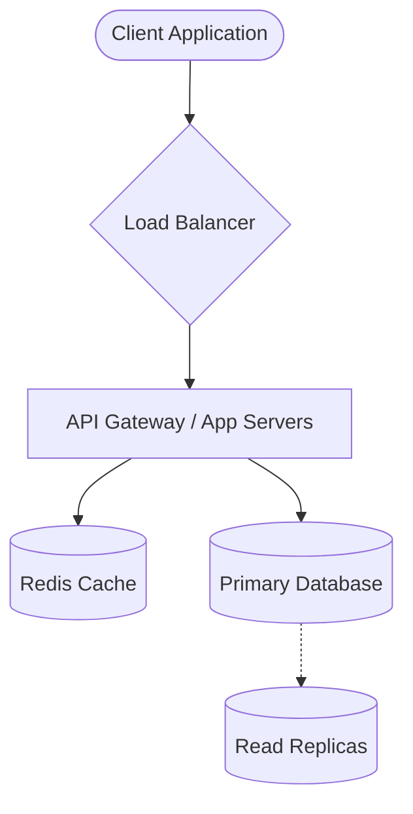

# System Design Practice: [System Name]

**Date:** YYYY-MM-DD
**Time Spent:** [Target: 45 minutes max]

---

## 1. Requirements & Scoping (5-10 mins)
*Tip: Treat this step as a conversation to define boundaries. Do not design the whole world, just what is explicitly in scope.*

### Functional Requirements
*What specific features and user behaviors must the system support to solve the problem?*
- [ ] 
- [ ] 
- [ ] *(Are there any explicitly out-of-scope features to ignore? e.g., Auth, Payments)*

### Non-Functional Requirements
*What are the constraints and quality attributes? These heavily dictate your architecture.*
- [ ] **Scale:** Expected Daily Active Users (DAU), Read/Write Queries Per Second (QPS).
- [ ] **Data Volume:** How much data is generated or stored per second/day/year?
- [ ] **Latency / Performance:** Is speed critical? *(e.g., Must respond in < 200ms)*
- [ ] **CAP Tradeoff:** In a network partition, do we prioritize Consistency (CP) or Availability (AP)?

---

## 2. Core Entities & API Design (5 mins)
*Tip: Defining APIs early solidifies the system boundaries and data interactions before you get stuck drawing boxes.*

### APIs
*What are the core endpoints external clients will hit?*
- `POST /v1/example` -> Request: `{}`, Response: `{}`
- `GET /v1/example/{id}` -> Response: `{}`

### Core Entities / Data Schema
*What are the main nouns? Will this map better to a SQL or NoSQL database?*
- **User:** `{ id, username, created_at }`
- **Item:** `{ id, user_id, payload }`

---

## 3. High-Level Design (10-15 mins)
*Tip: Draw the "Happy Path" first. Get the data from the client to the database. Narrate your choices out loud as if explaining to an interviewer.*

---

## 4. Deep Dives, Tradeoffs & Bottlenecks (10-15 mins)
*Tip: Identify Single Points of Failure (SPOF) and justify your technology decisions. Remember, there are no perfect architectures, only tradeoffs.*

### A. Data Storage Justification
- **SQL vs NoSQL:** *Why choose this? (e.g., "I chose Postgres because we need strict ACID compliance for transactions.")*

### B. Scaling & Optimization
- **Caching:** *What specific data is being cached? Are we using a CDN for static assets?*
- **Asynchronous Processing:** *Do we need Message Queues (Kafka) to offload heavy background tasks?*
- **Partitioning/Sharding:** *If a single hard drive fills up, how do we split the data? (e.g., Shard by UserID).*

### C. Bottlenecks / SPOFs
- *What happens if the primary database goes offline?*
- *What is the biggest bottleneck if traffic suddenly spikes 10x?*

---

## 5. Self-Evaluation & Reflection

### Key Insight
*Practice is only useful if you identify your weak points. Time management is usually the hardest part.*

### What went well?
- 

### What did I miss or struggle with?
- *(e.g., "I spent 20 minutes on the exact DB schema and had to rush the caching strategy.")*

### Action items to study:
- 
