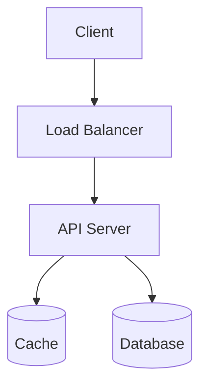

# System Design Practice: [System Name]

**Date:** YYYY-MM-DD
**Time Spent:** [Target: 40-45 minutes]

---

## 1. Requirements Exploration (5-10 mins)

### Functional Requirements
*What should the system do?*
- [ ] 
- [ ] 

### Non-Functional Requirements
*How should the system behave? (Scale, Latency, Reliability, Consistency vs. Availability)*
- [ ] Scale:
- [ ] Constraints/Limits:
- [ ] 

---

## 2. Core Entities / API Design (5 mins)

### APIs
*What are the core endpoints?*
- `POST /example` -> {}
- `GET /example/{id}` -> {}

### Core Entities
*What are the main objects?*
- Entity 1:
- Entity 2:

---

## 3. High-Level Design (10-15 mins)

*Draw your architecture here using Mermaid.js*

---

## 4. Deep Dives / Bottlenecks (10-15 mins)

*Focus on the hardest parts of the system. Trade-offs belong here.*
- **Component X:** Why did I choose this database? (e.g., SQL vs NoSQL)
- **Component Y:** How are we partitioning the data?
- **Component Z:** How to resolve race conditions?

---

## 5. Self-Evaluation

*What went well?*
- 

*What did I miss or struggle with?*
- 

*Action items to study:*
- 
