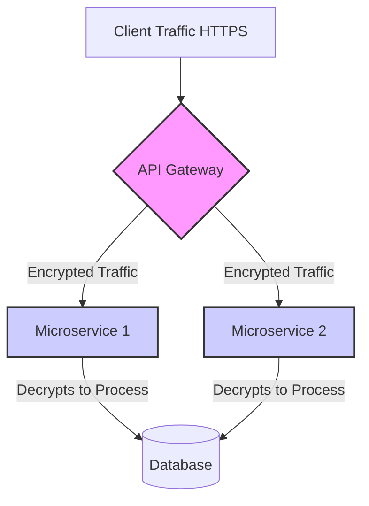

# System Design: Banking Application

Designing a banking application presents unique challenges heavily focused on security, data integrity, and strict consistency. While many consumer apps prioritize availability and speed, a banking system must prioritize exact correctness and data protection.

## Core Characteristics

### 1. Read-Heavy Traffic Profile
While we think of banks as places that process transactions, the actual technical workload is heavily skewed towards reads. 

**Q: Why is it important to distinguish between read and write transactions when determining non-functional requirements for a banking system?**
A: Banking applications are typically **read-heavy**. Users check their balances and transaction history far more frequently than they perform writes like transferring money or making payments. Understanding this ratio helps determine:
- **Appropriate system architecture** (e.g., provisioning read replicas).
- **Caching strategies** (e.g., safely caching recent transactions while strictly validating balances).
- **Resource allocation** (e.g., scaling database nodes appropriately based on the read vs. write disparity).

### 2. Strict Data Protection and Compliance
Financial data is highly sensitive and heavily regulated. Safeguards cannot be treated as optional features.

**Q: When designing a banking application, what are two key non-functional requirements related to data protection?**
A: 
1. **Encryption**: Transaction data must be strongly encrypted both **in-transit** (over the network) and **at-rest** (in the database).
2. **Process Compliance**: There must be strict data process compliance requirements to protect **PII (Personally Identifiable Information)**. Depending on the region, this may include rigorous auditing and adherence to frameworks like **GDPR**.

### 3. Data Durability and Disaster Recovery
A banking system cannot ever lose data. Establishing rigorous durability protocols is essential.

**Q: What are three important questions to ask about data durability and backup for a banking system?**
A: To correctly define availability targets and system recovery strategies, you must ask:
1. **How frequently should data be backed up?**
2. **How frequently should backups be verified/checked?**
3. **What is the maximum allowed time to restore from a backup?** (Establishing the Recovery Time Objective)

## Data Modeling

**Q: In a banking application, what would typically be the core entity in entity modeling?**  
A: A **Transaction**. While users and accounts are important, the transaction is the most critical event in a banking app. It dictates money movement, forms the immutable ledger, and is the primary focus when modeling the system's entities to ensure consistency and auditability.

## Architectural Trade-offs

### The Cost of End-to-End Encryption
To ensure maximum security, a banking architecture might mandate strict end-to-end encryption across all internal services. However, this introduces a massive architectural trade-off.

**Q: What is the tradeoff when implementing end-to-end encryption for transaction data in a microservices architecture?**
A: Normally, HTTPS traffic is decrypted at the edge (like an API Gateway) to make processing faster and avoid computational overhead within the internal, secure network. However, if data must be encrypted in transit throughout the entire system until it reaches the database, **every microservice must decrypt the data individually to use it**. This is computationally expensive, heavily impacts performance, and significantly increases system latency.
