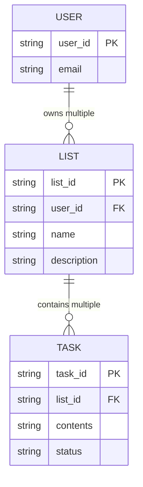

# System Design: To-Do Application

While highly ubiquitous, a To-Do application serves as a perfect foundational exercise for system design and API modeling. It demonstrates clear entity relationships without being bogged down by complex distributed systems logic right away.

## 1. Entity Modeling

The foundation of any basic CRUD (Create, Read, Update, Delete) application relies on correctly identifying the core nouns and their properties.

**Q: What are the three core entities in a to-do application system?**  
A: The main objects that need to be manipulated through the API are:
1. **User**
2. **List** (a collection grouping the tasks)
3. **Task** (or the "to-do" item itself)

### Defining Properties

Once entities are identified, you must outline the data structure (schema) for each.

**Q: What are the typical properties that should be modeled for a Task entity?**  
A: To capture the essential information needed to represent and track a task, it should include:
- `task_id` (Primary Key)
- `contents` (or description, representing the actual work)
- `status` (e.g., Pending, In Progress, Completed)

**Q: What are the typical properties that should be modeled for a List entity?**  
A: To define the structure and allow it to manage children tasks, a List should include:
- `name` (e.g., "Grocery", "Work")
- `description`
- `tasks` (A collection/array referencing its task entities)

### Entity Relationship Diagram (ERD)

*Note: In relational databases, the `List` wouldn't physically store an array of `Tasks`. Instead, each `Task` holds a Foreign Key (`list_id`) pointing back to the `List`.*

## 2. API Design

Based on these entities, the system requires an API to manipulate them. Following standard RESTful conventions:

- `POST /users` (Create user)
- `POST /lists` (Create a list for a user)
- `GET /lists/{list_id}` (Retrieve a list and its associated tasks)
- `POST /lists/{list_id}/tasks` (Add a new task)
- `PUT /tasks/{task_id}` (Update task contents or status)
