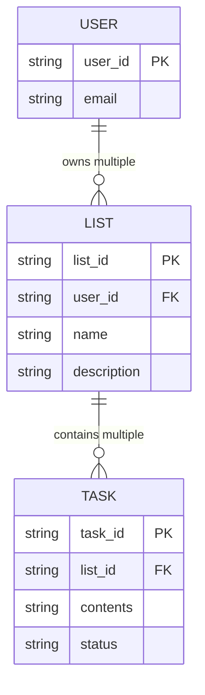
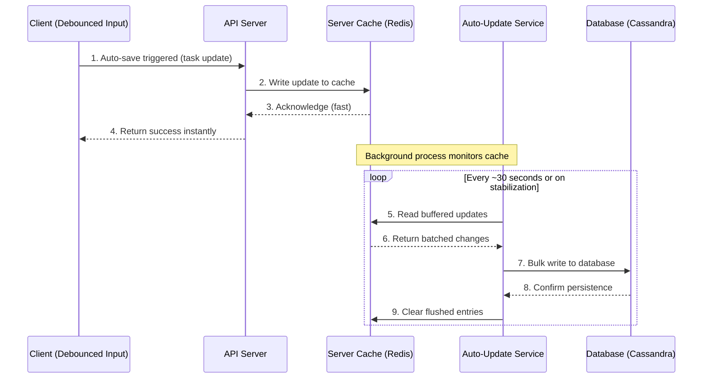
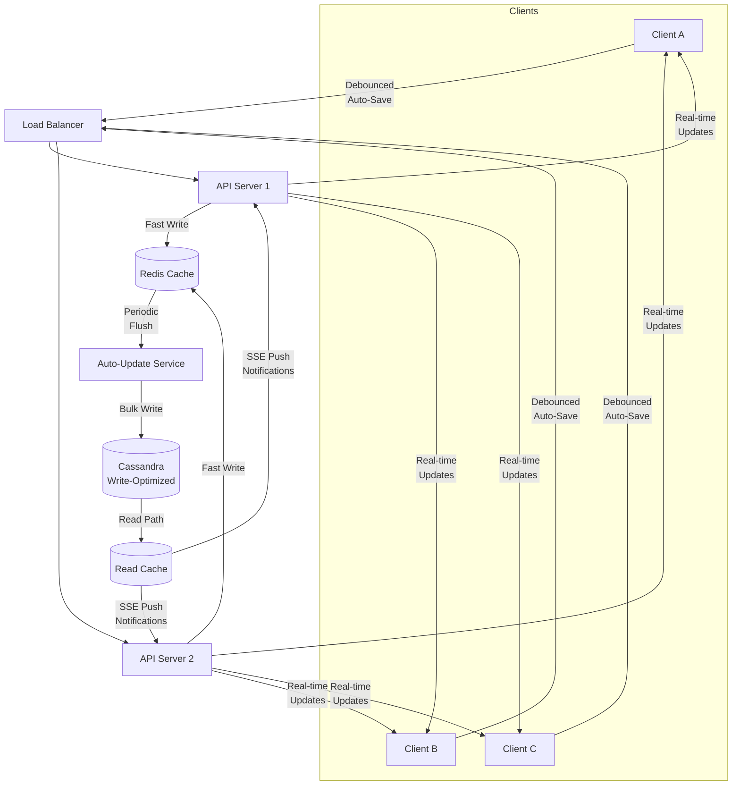

# System Design: To-Do Application

While highly ubiquitous, a To-Do application serves as a perfect foundational exercise for system design and API modeling. It demonstrates clear entity relationships without being bogged down by complex distributed systems logic right away.

## 1. Entity Modeling

The foundation of any basic CRUD (Create, Read, Update, Delete) application relies on correctly identifying the core nouns and their properties.

**Q: What are the three core entities in a to-do application system?**  
A: The main objects that need to be manipulated through the API are:
1. **User**
2. **List** (a collection grouping the tasks)
3. **Task** (or the "to-do" item itself)

### Defining Properties

Once entities are identified, you must outline the data structure (schema) for each.

**Q: What are the typical properties that should be modeled for a Task entity?**  
A: To capture the essential information needed to represent and track a task, it should include:
- `task_id` (Primary Key)
- `contents` (or description, representing the actual work)
- `status` (e.g., Pending, In Progress, Completed)

**Q: What are the typical properties that should be modeled for a List entity?**  
A: To define the structure and allow it to manage children tasks, a List should include:
- `name` (e.g., "Grocery", "Work")
- `description`
- `tasks` (A collection/array referencing its task entities)

### Entity Relationship Diagram (ERD)

*Note: In relational databases, the `List` wouldn't physically store an array of `Tasks`. Instead, each `Task` holds a Foreign Key (`list_id`) pointing back to the `List`.*

## 2. API Design

Based on these entities, the system requires an API to manipulate them. Following standard RESTful conventions:

- `POST /users` (Create user)
- `POST /lists` (Create a list for a user)
- `GET /lists/{list_id}` (Retrieve a list and its associated tasks)
- `POST /lists/{list_id}/tasks` (Add a new task)
- `PUT /tasks/{task_id}` (Update task contents or status)

## 3. Auto-Save Feature Design

When extending the To-Do application to support real-time collaboration across multiple clients (e.g., a shared grocery list between family members), the system must evolve from a simple CRUD app into a multi-client, event-driven architecture. The cornerstone of this evolution is the **auto-save feature**—automatically persisting user changes without requiring an explicit "Save" button.

### Functional Requirements Breakdown

Designing an auto-save feature for a multi-client application demands carefully addressing several interrelated requirements:

#### 1. Save Interval (How Often?)
The system must decide how frequently to persist changes. Saving on every single keystroke is wasteful and creates enormous write pressure. A practical approach is to use **debouncing**: the system waits for a period of user inactivity (e.g., 2–5 seconds of no typing) before triggering a save. This ensures that only *stabilized* input is persisted, dramatically reducing the volume of writes.

#### 2. What Data to Save (Granularity)
The system must choose between saving the **entire document/list**, individual **task-level changes**, or **diffs** (only the delta between the previous and current state). Diffs are the most bandwidth-efficient but introduce complexity in reconstruction. For a To-Do app, task-level granularity strikes the best balance—each task is a small, discrete unit that can be saved independently without the overhead of diffing.

#### 3. Conflict Resolution (Multi-Client Writes)
When two clients modify the same task simultaneously, the system needs a conflict strategy:
*   **Last-Write-Wins (LWW):** The most recent timestamp overwrites previous changes. Simple but risks silently losing edits.
*   **Operational Transform (OT) / CRDTs:** Sophisticated algorithms that merge concurrent edits intelligently. Used by Google Docs but adds significant complexity for a To-Do app.
*   **Optimistic Locking with Versioning:** Each task carries a version number. If a client attempts to save an update based on a stale version, the server rejects it and forces a refresh. This is often the sweet spot for task-based applications.

#### 4. Client Notification (How to Inform Other Clients?)
When one client saves a change, other connected clients must be notified. The choice of protocol depends on the directionality of updates:
*   **Server-Sent Events (SSE):** Ideal here. The server pushes update notifications to all connected clients over a lightweight, stateless HTTP connection. Since the clients only need to *receive* change notifications (not send them over this channel—saves go through the REST API), SSE avoids the scaling complexity of WebSockets.
*   **WebSockets:** Justified only if the app requires extremely low-latency, bidirectional real-time collaboration (closer to Google Docs than a shared grocery list).

#### 5. Read-Write Ratio Shift
A critical architectural insight: enabling auto-save fundamentally **shifts the read-write ratio**. A standard To-Do app is read-heavy (users view tasks far more than they create them). With auto-save firing every few seconds per active user, the system suddenly becomes **write-heavy**, which demands a different database and caching strategy.

### Architecture: Cache Buffering with an Auto-Update Service

Writing every auto-save event directly to the database would cause **database thrashing**—a flood of rapid, small, mostly redundant writes that overwhelm the database with unnecessary I/O. The solution is to introduce a **server-side cache buffer** with an **auto-update service** that intelligently batches and flushes writes.

**How it works:**
1.  The client's auto-save fires after detecting input stabilization (debouncing).
2.  The API server writes the update to a fast **in-memory cache** (e.g., Redis) and immediately returns success to the client.
3.  A background **auto-update service** periodically checks the cache. If data has stabilized (e.g., 30 seconds of no further changes to that task), it bulk-writes the final version to the primary database.
4.  This eliminates redundant intermediate writes where the user was still mid-thought.

### The Availability vs. Consistency Trade-Off

This cache-buffered architecture makes an explicit trade-off: it **biases towards availability over consistency**. The client receives an instant acknowledgment that their save succeeded (high availability), but the data has not yet been durably persisted to the database. If the cache server crashes during the interval between the cache write and the database flush, **all buffered auto-save data is permanently lost**.

This is an acceptable trade-off for a To-Do application (losing a partially typed task title is inconvenient, not catastrophic), but would be entirely unacceptable for a banking transaction. The system designer must explicitly acknowledge and communicate this risk.

### Database Selection: Write-Optimized Storage

Because auto-save fundamentally transforms the system into a write-heavy workload, the database tier should be optimized accordingly. A column-family database like **Apache Cassandra** is well-suited here:
*   **Write-optimized:** Cassandra uses an append-only Log-Structured Merge Tree (LSM-Tree), making writes extremely fast.
*   **Horizontal scalability:** Native sharding and replication without the ACID overhead of relational databases.
*   **Tunable consistency:** Allows configuring the consistency level per query, letting you trade consistency for speed on non-critical writes.

> **Design Principle:** The auto-save subsystem can use a *different* database than the primary read path. The main application might still serve reads from a relational database or read-optimized cache, while auto-save writes flow into Cassandra. This is a common pattern called **polyglot persistence**—using different databases for different workloads within the same system.

### Full Auto-Save Architecture Overview

