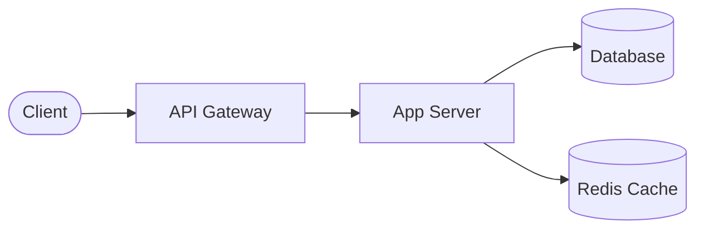

# URL Shortener

## 1. Requirements

### Functional
- Shorten URL
- Redirect
- Optional custom alias

### Non-Functional
- High read traffic
- Low latency
- High availability

---

## 2. High-Level Design

---

## 3. Key Components
- Hash generator
- Database (key-value)
- Cache (Redis)

---

## 4. Deep Dives

### ID Generation
- Random
- Base62 encoding
- Counter-based

### Tradeoffs
- Random → collisions
- Counter → predictable

---

## 5. Scaling
- Add cache
- CDN for redirects
- DB sharding

---

## 6. Interview Notes
- Read-heavy system
- Focus on caching + fast lookup