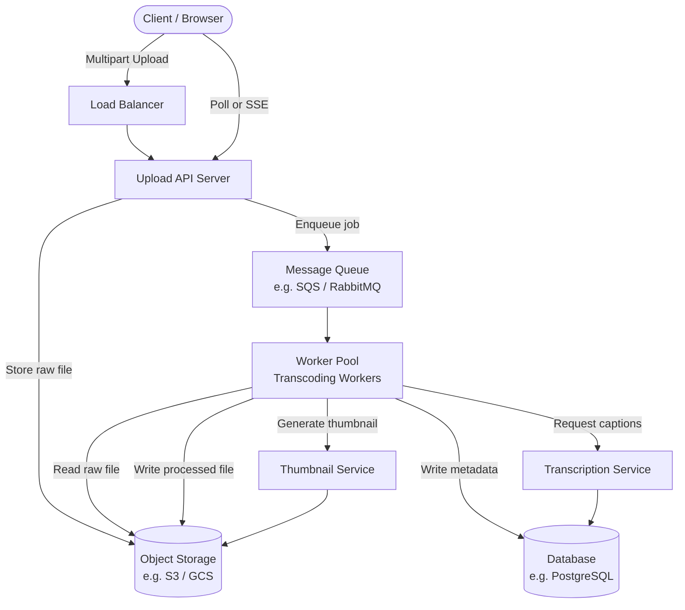
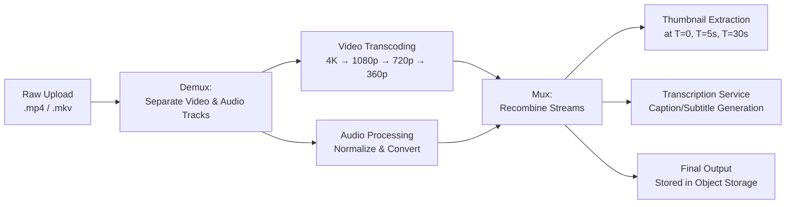

# Video Upload & Streaming System

Designing a video upload and streaming service (think YouTube or TikTok uploads) is a rich system design problem. It uniquely combines large file ingestion, multi-stage asynchronous processing, and media-specific challenges like format conversion and audio handling — all at potentially massive scale.

---

## 1. Requirements & Scoping

Before drawing a single box, you must lock down constraints with the interviewer. Video systems have extremely wide solution spaces depending on the answers.

### Functional Requirements

| Requirement | Decision |
|---|---|
| Supported formats | MP4 (primary); potentially MKV, AVI |
| Maximum resolution | Up to 4K (3840×2160) |
| Maximum file size | 4 GB per upload |
| Thumbnail generation | Yes — auto-generated at upload time |
| Video trimming / preprocessing | Yes — basic trim before processing |
| Caption / subtitle generation | Yes — via transcription service |
| Audio handling | Treated as a **separate track** during processing |

**Q: Why must supported formats, resolution limits, and file size caps be defined before designing the upload system?**
A: These specifications define the entire scope of the technical problem. File size limits determine upload chunking strategy (4 GB files cannot be uploaded in a single HTTP request reliably). Maximum resolution determines compute requirements for transcoding workers. Supported formats determine which codec libraries and processing pipelines are needed. Without these explicit constraints, you risk building a system that is either wildly over-engineered or fundamentally incapable of handling the actual data it will receive.

---

### Non-Functional Requirements

- **Upload throughput:** System must sustain concurrent multi-gigabyte uploads without timeouts.
- **Processing time:** Processed and playable video should be available within a reasonable SLA (e.g., under 5 minutes for a 1 GB video).
- **Availability:** Upload service should target 99.9% uptime.
- **Concurrent users:** System must handle concurrent uploads and streams without degradation.
- **Durability:** Uploaded raw files and processed outputs must be stored durably (e.g., replicated object storage like S3).

**Q: What types of functional and non-functional requirements should be gathered before designing a video upload workflow?**
A: **Functional requirements** include: supported video formats, maximum resolution, file size limits, thumbnail generation, video trimming/preprocessing, caption generation, and audio handling strategy. **Non-functional requirements** include: upload speed targets, processing time SLAs, concurrent user capacity, system availability targets, and data durability guarantees. Both sets of requirements are critical — functional requirements tell you *what* to build, and non-functional requirements tell you *how well* it must perform. They are often in tension with each other (e.g., supporting 4K with a 5-minute processing SLA requires significantly more compute than 1080p with a 30-minute SLA).

---

## 2. Capacity Estimation

### Upload Volume

A simple estimation grounds the architecture in reality:

| Variable | Value |
|---|---|
| Total users | 1,000 |
| Uploads per user per day | 1 |
| **Total uploads per day** | **1,000** |

For a larger-scale scenario (e.g., 1M users uploading once per day): **1,000,000 uploads/day ≈ 11.6 uploads/second** — this is the write throughput the system must sustain.

### Storage Estimation

| Variable | Value |
|---|---|
| Average raw file size | 1 GB |
| Total uploads per day | 1,000 |
| **Raw storage per day** | **1 TB/day** |

At this scale, raw video storage alone demands a dedicated object storage solution (e.g., AWS S3, GCS) — traditional databases cannot handle binary blobs of this size efficiently or cost-effectively.

**Q: How can you estimate the upload capacity requirements for a video upload service?**
A: Start from the user base: determine the total number of active users and their average upload frequency (e.g., 1 upload/user/day). Multiply these together to get total uploads per day, then divide by 86,400 seconds to get uploads per second (your write throughput target). For storage, multiply total daily uploads by the average file size. This back-of-the-envelope math quickly reveals whether the system is storage-bound (common for video), throughput-bound, or both — and directly informs whether you need object storage, sharded databases, or aggressive CDN caching.

---

## 3. High-Level Architecture

The upload flow is inherently asynchronous — the user cannot wait minutes for transcoding to complete before getting a response. The system decouples the upload from the processing using a message queue.

**Key insight:** The client sends a file, gets an immediate `202 Accepted`, and then polls (or receives a Server-Sent Event) when processing completes. The heavy lifting happens entirely in the background worker pool.

---

## 4. Processing Pipeline Deep Dive

### The Multi-Stage Pipeline

Video processing is not a single operation — it is a sequence of discrete, parallelisable stages. Each stage can be scaled independently based on bottlenecks.

### Why Audio Must Be Treated Separately

**Q: Why is it important to make explicit assumptions about audio handling when designing a video processing system?**
A: Audio tracks must be **demuxed (separated) from the video stream** before transcoding begins. This is not optional — it is how modern video codecs work. Different container formats handle audio differently: MP4 typically contains a single AAC audio track, while MKV can contain multiple audio tracks (e.g., different languages, commentary, Dolby Atmos). During transcoding, the video frames and audio frames are processed by entirely different codec engines. The audio is re-encoded separately (e.g., converted from PCM to AAC or Opus), then remuxed back into the output container. Failing to make this assumption explicit means your worker design will miss the audio processing step, resulting in output videos with no sound — a subtle but catastrophic bug at production scale.

### Thumbnail Generation

At minimum, extract a frame at a fixed timestamp (e.g., T=5 seconds). Optionally, generate multiple candidate thumbnails and let the uploader select one. Store in object storage alongside the video, and cache the URL in the metadata database.

### Caption / Subtitle Generation

Route the audio track to a transcription service (e.g., AWS Transcribe, OpenAI Whisper). This is a separate asynchronous step — caption availability is decoupled from video availability, since users can watch a video before captions are ready.

---

## 5. Key Design Decisions & Trade-offs

### Chunked Uploads (Multipart Upload)

A 4 GB file cannot be reliably uploaded in a single HTTP request. Large files must be split into chunks (e.g., 5–50 MB each) and uploaded in parallel. The server (or object storage SDK) reassembles them. Benefits:
- **Resumability:** If the network drops mid-upload, only the failed chunks need retransmission.
- **Parallelism:** Multiple chunks upload simultaneously, maximizing bandwidth utilization.

AWS S3 and GCS both offer native multipart upload APIs for this pattern.

### Storage: Object Storage, not a Database

Raw video files and processed outputs must live in **object storage** (S3, GCS, Azure Blob), not a relational database. Reasons:
- Object storage is optimized for large binary blobs.
- It provides native CDN integration for streaming.
- Cost per GB is dramatically lower than database disk.
- Only metadata (title, owner, processing status, CDN URLs) lives in the relational database.

### Worker Scaling

Transcoding is CPU-intensive and horizontally scalable. Workers should auto-scale based on queue depth — when the queue grows, launch more worker instances. When idle, scale to zero to control costs.

---

## 6. Suggested Tech Stack

| Layer | Technology |
|---|---|
| Upload API | Node.js / Go (high concurrency, I/O bound) |
| Object Storage | AWS S3 / Google Cloud Storage |
| Message Queue | AWS SQS / RabbitMQ |
| Transcoding Workers | FFmpeg (on EC2 / Kubernetes pods) |
| Metadata Database | PostgreSQL |
| Thumbnail CDN | CloudFront / Fastly |
| Transcription | AWS Transcribe / OpenAI Whisper |
| Status notifications | Server-Sent Events (SSE) |
