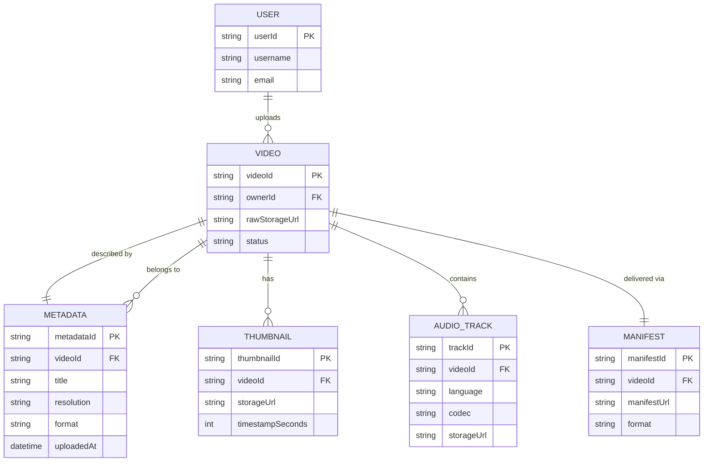
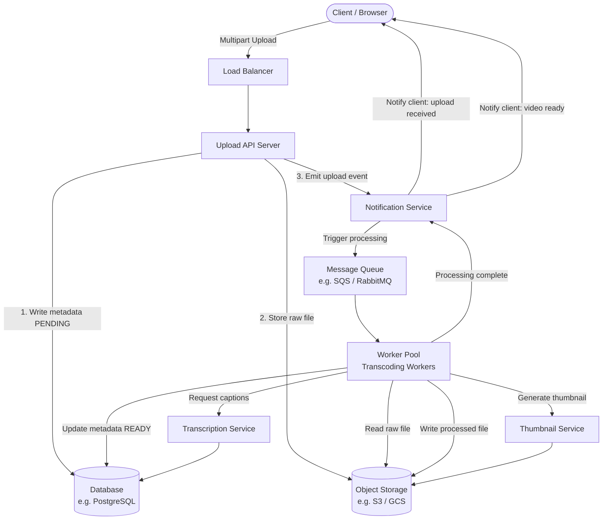
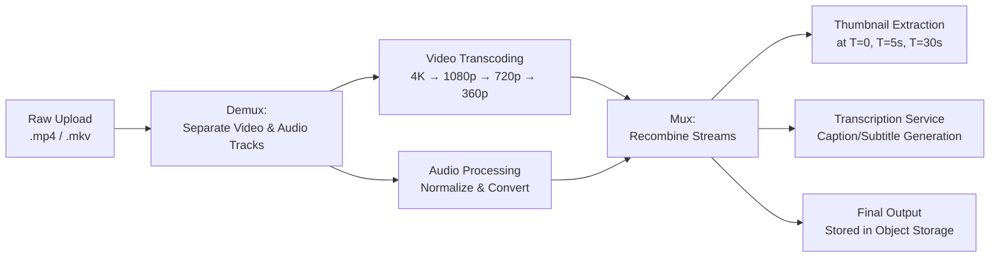
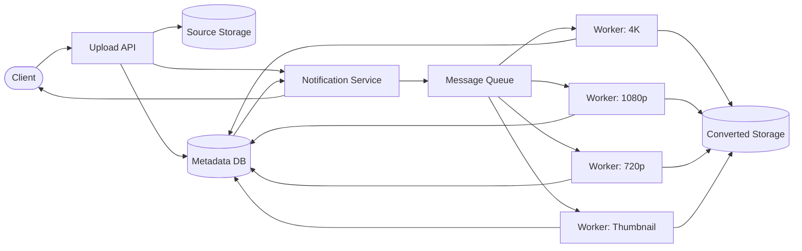

# Video Upload & Streaming System

Designing a video upload and streaming service (think YouTube or TikTok uploads) is a rich system design problem. It uniquely combines large file ingestion, multi-stage asynchronous processing, and media-specific challenges like format conversion and audio handling — all at potentially massive scale.

---

## 1. Requirements & Scoping

Before drawing a single box, you must lock down constraints with the interviewer. Video systems have extremely wide solution spaces depending on the answers.

### Functional Requirements

| Requirement | Decision |
|---|---|
| Supported formats | MP4 (primary); potentially MKV, AVI |
| Maximum resolution | Up to 4K (3840×2160) |
| Maximum file size | 4 GB per upload |
| Thumbnail generation | Yes — auto-generated at upload time |
| Video trimming / preprocessing | Yes — basic trim before processing |
| Caption / subtitle generation | Yes — via transcription service |
| Audio handling | Treated as a **separate track** during processing |

**Q: Why must supported formats, resolution limits, and file size caps be defined before designing the upload system?**
A: These specifications define the entire scope of the technical problem. File size limits determine upload chunking strategy (4 GB files cannot be uploaded in a single HTTP request reliably). Maximum resolution determines compute requirements for transcoding workers. Supported formats determine which codec libraries and processing pipelines are needed. Without these explicit constraints, you risk building a system that is either wildly over-engineered or fundamentally incapable of handling the actual data it will receive.

---

### Non-Functional Requirements

- **Upload throughput:** System must sustain concurrent multi-gigabyte uploads without timeouts.
- **Processing time:** Processed and playable video should be available within a reasonable SLA (e.g., under 5 minutes for a 1 GB video).
- **Availability:** Upload service should target 99.9% uptime.
- **Concurrent users:** System must handle concurrent uploads and streams without degradation.
- **Durability:** Uploaded raw files and processed outputs must be stored durably (e.g., replicated object storage like S3).

**Q: What types of functional and non-functional requirements should be gathered before designing a video upload workflow?**
A: **Functional requirements** include: supported video formats, maximum resolution, file size limits, thumbnail generation, video trimming/preprocessing, caption generation, and audio handling strategy. **Non-functional requirements** include: upload speed targets, processing time SLAs, concurrent user capacity, system availability targets, and data durability guarantees. Both sets of requirements are critical — functional requirements tell you *what* to build, and non-functional requirements tell you *how well* it must perform. They are often in tension with each other (e.g., supporting 4K with a 5-minute processing SLA requires significantly more compute than 1080p with a 30-minute SLA).

---

## 2. Capacity Estimation

### Upload Volume

A simple estimation grounds the architecture in reality:

| Variable | Value |
|---|---|
| Total users | 1,000 |
| Uploads per user per day | 1 |
| **Total uploads per day** | **1,000** |

For a larger-scale scenario (e.g., 1M users uploading once per day): **1,000,000 uploads/day ≈ 11.6 uploads/second** — this is the write throughput the system must sustain.

### Storage Estimation

| Variable | Value |
|---|---|
| Average raw file size | 1 GB |
| Total uploads per day | 1,000 |
| **Raw storage per day** | **1 TB/day** |

At this scale, raw video storage alone demands a dedicated object storage solution (e.g., AWS S3, GCS) — traditional databases cannot handle binary blobs of this size efficiently or cost-effectively.

**Q: How can you estimate the upload capacity requirements for a video upload service?**
A: Start from the user base: determine the total number of active users and their average upload frequency (e.g., 1 upload/user/day). Multiply these together to get total uploads per day, then divide by 86,400 seconds to get uploads per second (your write throughput target). For storage, multiply total daily uploads by the average file size. This back-of-the-envelope math quickly reveals whether the system is storage-bound (common for video), throughput-bound, or both — and directly informs whether you need object storage, sharded databases, or aggressive CDN caching.

---

## 3. Data Model & Core Entities

Before drawing a single architecture box, a senior engineer identifies the **entities** the system must manage. For a video platform, these are six distinct, collaborating objects. Getting them wrong (or forgetting one) cascades into fundamental design mistakes downstream.



### The Six Canonical Entities

| Entity | Role |
|---|---|
| **User** | The person performing the upload. Owns all content created in the session. |
| **Video** | The central object — stores references to both the raw source file and all processed output variants. |
| **Metadata** | Title, resolution, format, upload timestamp, and processing status. Attached separately because raw video files carry no inherent properties. |
| **Thumbnail** | One or more preview frames extracted at fixed timestamps (T=0, T=5s, T=30s). Stored independently in object storage. |
| **Audio Track** | The demuxed audio stream, stored and processed separately from the video frames. |
| **Manifest** | The adaptive bitrate descriptor that tells the client *which video variant* to play based on device capability and network conditions. |

### Why Metadata Separation Is Architecturally Non-Negotiable

Two fundamentally different storage systems handle two fundamentally different types of data in a video platform:

- **Object storage (S3 / GCS)** — optimized for large, opaque binary blobs. It can hold a 4 GB video file efficiently and cheaply, but it has no query engine. You cannot ask it "find all videos uploaded by user X" or "find all videos still processing."
- **Relational database (PostgreSQL)** — optimized for structured text data, indexable fields, and complex queries. But it cannot efficiently store or stream gigabytes of binary video data per row.

This is why they must be separated: each system does what it is actually built for. The video blob lives in object storage; the video's identity, ownership, and lifecycle state live in the database as a metadata record.

#### The Orphaned File Problem — A Concrete Failure Scenario

An "orphaned file" is a video file that exists in object storage but has **no corresponding metadata record in the database**. The file is physically present, occupying storage and costing money, but the application has no way to find it, display it, associate it with a user, or delete it when needed. It is invisible to the system.

This happens when the order of operations is wrong:

```mermaid
flowchart TD
    subgraph WRONG ["❌ Wrong Order — Orphaned File Created"]
        direction LR
        A1[Client uploads video] --> B1[API stores blob\nin object storage]
        B1 --> C1["💥 Server crashes\nbefore writing metadata"]
        C1 --> D1["🪣 Blob sits in S3 forever\n(no metadata = unreachable)"]
    end

    subgraph RIGHT ["✅ Correct Order — Atomic Commitment"]
        direction LR
        A2[Client uploads video] --> B2[API writes metadata record\nto DB with status = PENDING]
        B2 --> C2[API stores blob\nin object storage]
        C2 --> D2[API updates metadata\nstatus = UPLOAD_COMPLETE]
        D2 --> E2[System can always\nquery, manage, delete]
    end
```



In the **wrong order**: the blob is stored first, the server then crashes before the metadata write succeeds. The file now exists in S3 with no database record pointing to it. No user ID, no title, no processing status. The system cannot list it, play it, attribute storage costs to a user, or clean it up. It is a ghost.

In the **correct order**: the metadata record is the *first* thing written, with a `PENDING` status. Even if the blob upload fails after this point, the system knows a video was attempted — it can surface an error to the user, retry the upload, or purge the stale record via a background cleanup job. The metadata record is the anchor; the blob is what hangs from it.

**Q: Why is it architecturally important to separate metadata storage from video blob storage, and how do orphaned files get created?**
A: Blob storage (e.g., S3) is optimized for large binary files but has no query engine — you cannot search it for "all videos by user X." A relational database is optimized for structured, queryable data but cannot efficiently store multi-GB video files. They are separated because each system does what it is built for. An orphaned file is created when the blob is written to object storage *before* the metadata record is committed to the database, and then a failure (server crash, network error) interrupts the metadata write. The blob now exists in S3 with no database record: the system cannot find it, display it, or delete it. The correct approach is to write the metadata record first (with status `PENDING`), then store the blob, then update the status — so even on failure, the metadata anchor exists and the system can recover or clean up.

### The Manifest: Adaptive Bitrate Delivery

The **manifest** is the mechanism that makes adaptive bitrate streaming (ABR) possible. When the backend finishes processing, it produces multiple resolution variants of the video (e.g., 4K, 1080p, 720p, 360p) and stores them in object storage. The manifest is a small descriptor file — typically in **HLS (`.m3u8`)** or **DASH (`.mpd`)** format — that lists all available variants, their bitrates, and their storage URLs.

When the client opens a video:
1. It fetches the manifest first.
2. It inspects the available bitrate tiers alongside its current network conditions and screen resolution.
3. It selects the appropriate variant to stream — a phone on a weak connection automatically picks 360p; a 4K TV on a wired connection picks the highest tier.
4. As network conditions change mid-playback, the player re-reads the manifest and switches segments without interruption.

**Q: What is the purpose of a manifest in a video streaming system, and how does it drive adaptive bitrate streaming?**
A: A manifest is a small descriptor file (HLS `.m3u8` or DASH `.mpd`) that lists all available quality variants of a video — their resolution, bitrate, and storage URLs — generated after transcoding completes. The client player fetches it first, then uses it to select the appropriate variant based on its screen size and real-time network throughput. This is how the system avoids wasting bandwidth sending 4K to a mobile phone — the manifest gives the client the intelligence to self-select the optimal tier, and to seamlessly switch tiers mid-stream as conditions change.

---

## 4. High-Level Architecture

The upload flow is inherently asynchronous — the user cannot wait minutes for transcoding to complete before getting a response. The system decouples the upload from the processing using a message queue. A **Notification Service** acts as the coordination hub: it watches for upload completion events, notifies the client that the upload was received, and signals the processing pipeline to begin.



**Key insight:** The client sends a file, gets an immediate `202 Accepted`, and receives two subsequent notifications: one confirming the raw upload was stored, and one confirming processing is complete and the video is playable. The Notification Service is the single component that bridges these two asynchronous phases.

### The Notification Service

In a naive design, the worker directly pushes a notification to the client when processing finishes. This creates tight coupling between the worker (a compute component) and the client communication layer. Instead, a dedicated **Notification Service** decouples these responsibilities:

| Responsibility | Who handles it |
|---|---|
| Watch for successful raw upload to object storage | Notification Service |
| Inform client that upload was received (`202 Accepted`) | Notification Service |
| Trigger the processing pipeline (enqueue job) | Notification Service |
| Watch for processing worker completion | Notification Service |
| Inform client that video is ready to play | Notification Service |

This architecture means the processing workers never need to know about clients, and the upload API never needs to know about the processing pipeline. The Notification Service is the sole coordinator.

#### The Notification Service Must Be Stateless

A critical design mistake is having the Notification Service **track the completion status of multiple in-flight conversion jobs** itself — maintaining an internal map of "which jobs have finished" in memory. This is dangerous for one concrete reason: **if the Notification Service crashes, all tracking state is lost**.

Workers don't retain completion information either — once a worker finishes a job and emits a completion event, it moves on to the next job. If the Notification Service was the sole holder of "job X is 2 of 4 formats complete," that information vanishes on crash. The system has no way to resume coordination.

The correct approach is to have job completion **written back to the database** (via the metadata record) by each worker as it finishes. The database becomes the durable source of truth for job status — not the Notification Service's memory. The Notification Service then *reads* from the database to check overall completion, rather than *holding* that state itself. Any service that goes down and restarts can re-read the database and resume from a known, durable state.

**Q: What is the role of a Notification Service in a video upload workflow, and why should it be a dedicated component?**
A: The Notification Service acts as the coordination backbone between the three major phases of video upload: raw ingestion, processing, and client communication. It watches for the raw upload reaching object storage, notifies the client that the upload was received, and triggers the processing pipeline. When processing completes, it notifies the client again that the video is ready to play. Making it a dedicated component decouples the upload API from the processing pipeline and both from the client communication layer — preventing tight coupling that would make each component harder to scale and test independently.

**Q: Why is it problematic to have the Notification Service track the completion status of multiple in-flight conversion jobs internally?**
A: If the Notification Service holds job completion state in memory (e.g., "video X has completed 2 of 4 conversion formats"), a crash wipes that state entirely. Workers don't retain completion records either — they emit an event and move on. The result is an unrecoverable loss of coordination state: the system no longer knows which jobs finished and which are pending. The correct design writes job completion back to the database via the metadata record after each worker finishes. The database is the durable source of truth; the Notification Service reads from it rather than owning the state.

### API Design for Video Upload

The API surface for a video upload system is deliberately minimal — a direct translation of the functional requirements:

| Method | Endpoint | Purpose |
|---|---|---|
| `POST` | `/videos` | Initiate a new upload; returns a video ID and upload URL |
| `GET` | `/videos/{id}` | Poll for processing status and retrieve playback URLs |
| `DELETE` | `/videos/{id}` | Remove a video and its associated metadata/blobs |

The `POST /videos` request body requires two things:

```json
{
  "title": "My Vacation Highlights",
  "video": "<binary file reference or multipart form-data>"
}
```

This separation is deliberate: `title` is **user-provided metadata** — information the creator assigns to the video. The binary file itself carries technical metadata (MIME type, file extension, byte size), but these are derived from the file, not from the user. They are captured and stored separately by the system at ingestion time, not passed in the request body. Keeping the API minimal (only what the user actively provides) prevents the client from polluting the server's data model with fields it should be deriving itself.

**Q: When designing the POST /videos API endpoint for a video upload system, what belongs in the request body and why?**
A: The request body should contain only what the user actively provides: the video file (as multipart form-data) and user-defined metadata like the title. It should *not* ask the client to supply technical file metadata like content type, resolution, or codec — those are derived server-side at ingestion time and stored in the metadata database by the system. Separating user-provided data from system-derived data keeps the API clean and prevents the client from supplying values the server cannot trust or validate.

---

## 5. Processing Pipeline Deep Dive

### The Multi-Stage Pipeline

Video processing is not a single operation — it is a sequence of discrete, parallelisable stages. Each stage can be scaled independently based on bottlenecks.



### Separating Source Storage from Converted Storage

A production video system maintains **two distinct object storage buckets** — one for raw source uploads and one for the processed, delivery-ready output. These are not interchangeable, and mixing them is a design mistake:

| Dimension | Source Storage | Converted Storage |
|---|---|---|
| **Content** | Raw, unmodified upload (original file) | All transcoded variants (4K, 1080p, 720p, 360p) + thumbnails + manifests |
| **Access control** | **Private** — only internal processing workers need access | **Public or CDN-served** — this is what viewers stream from |
| **Lifecycle** | Can be deleted after conversion completes to recover storage costs | Permanent — these are the served assets |
| **Purpose** | Immutable source of truth for reprocessing | Delivery layer |

The source bucket should never be publicly accessible. Raw uploads are large, unoptimized, and potentially unsafe to stream — they haven't been validated or normalized by the pipeline. Exposing source URLs to clients would bypass all the work the processing pipeline does to produce safe, correctly formatted, bandwidth-appropriate output.

Once conversion is verified complete and all processed variants are confirmed in the converted bucket, the source file can be deleted. Raw 4K source files are dramatically larger than their processed counterparts — deleting them after processing is a significant cost-saving lifecycle policy, not an afterthought.

The source storage should also stay raw (unprocessed at upload time) for deeper reasons:

- **Separation of concerns:** The Upload API's only job is ingestion — receive the file and store it durably. The Processing Service's job is to pull the file apart. Mixing these responsibilities makes both components harder to reason about, test, and scale independently.
- **Reprocessability:** If the pipeline has a bug or requirements change (e.g., adding an 8K output tier), re-processing requires the pristine original. If it was modified during upload, that original is permanently gone.
- **Centralized processing logic:** All the intelligence about how to extract metadata, split streams, and generate thumbnails lives in the Processing Service — one place to fix bugs and add features.

Think of source storage like a photographic negative: you never touch the negative. You make prints from it, and each print can be made differently. The converted bucket holds the prints.

**Q: Why must source video storage and converted video storage be separate systems, and what different rules govern each?**
A: Source storage holds the raw, unmodified upload and must be **private** — only the processing workers should access it. It exists only to give the Processing Service a reliable, pristine original to work from, and can be deleted once conversion is verified complete (recovering significant storage costs). Converted storage holds all processed output variants and is **publicly accessible via CDN** — this is what viewers actually stream. Mixing the two creates security risks (exposing unvalidated raw files to the public), lifecycle confusion (which files are safe to delete?), and architectural ambiguity (which bucket do workers write to and read from?).

### Why Audio Must Be Treated Separately

**Q: Why is it important to make explicit assumptions about audio handling when designing a video processing system?**
A: Audio tracks must be **demuxed (separated) from the video stream** before transcoding begins. This is not optional — it is how modern video codecs work. Different container formats handle audio differently: MP4 typically contains a single AAC audio track, while MKV can contain multiple audio tracks (e.g., different languages, commentary, Dolby Atmos). During transcoding, the video frames and audio frames are processed by entirely different codec engines. The audio is re-encoded separately (e.g., converted from PCM to AAC or Opus), then remuxed back into the output container. Failing to make this assumption explicit means your worker design will miss the audio processing step, resulting in output videos with no sound — a subtle but catastrophic bug at production scale.

### Thumbnail Generation

At minimum, extract a frame at a fixed timestamp (e.g., T=5 seconds). Optionally, generate multiple candidate thumbnails and let the uploader select one. Store in object storage alongside the video, and cache the URL in the metadata database.

### Caption / Subtitle Generation

Route the audio track to a transcription service (e.g., AWS Transcribe, OpenAI Whisper). This is a separate asynchronous step — caption availability is decoupled from video availability, since users can watch a video before captions are ready.

---

## 6. Key Design Decisions & Trade-offs

### Upload Failure Handling

Uploads should never be assumed successful by default. Large video files are uniquely vulnerable to failure mid-transfer: the client may have an unstable connection, the upload window may time out on a slow network, or the server may reject a chunk due to a transient error. A production upload system must:

- **Acknowledge completion explicitly:** The client receives a `202 Accepted` only after the raw file is confirmed durably written to object storage — not merely received by the API server.
- **Track upload state:** Maintain a status record in the metadata database (`PENDING → UPLOADING → UPLOAD_COMPLETE → PROCESSING → READY`) so the system can detect stalled or abandoned uploads and alert the user.
- **Support recovery:** Chunked uploads (multipart) allow resuming from the last successful chunk without re-uploading the entire file.
- **Notify on completion:** Once processing finishes, the system notifies the user via SSE or webhook — the user should never have to guess whether their upload succeeded.

**Q: Why should uploads never be assumed successful, and what must the system do to handle upload failures gracefully?**
A: Large video files are inherently fragile to transfer — the client may have a slow or unstable connection, the upload may time out, or a chunk may fail mid-transfer. A system that assumes success silently discards data. Instead, the system must track upload status explicitly in the metadata database through a well-defined state machine, return an acknowledgment only after durable storage is confirmed, support chunk-level resumability so the entire file doesn't need to be re-sent, and proactively notify users when their upload finishes processing — eliminating the ambiguity of "did my video go through?"

### Chunked Uploads (Multipart Upload)

A 4 GB file cannot be reliably uploaded in a single HTTP request. Large files must be split into chunks (e.g., 5–50 MB each) and uploaded in parallel. The server (or object storage SDK) reassembles them. Benefits:
- **Resumability:** If the network drops mid-upload, only the failed chunks need retransmission.
- **Parallelism:** Multiple chunks upload simultaneously, maximizing bandwidth utilization.

AWS S3 and GCS both offer native multipart upload APIs for this pattern.

### Storage: Object Storage, not a Database

Raw video files and processed outputs must live in **object storage** (S3, GCS, Azure Blob), not a relational database. Reasons:
- Object storage is optimized for large binary blobs.
- It provides native CDN integration for streaming.
- Cost per GB is dramatically lower than database disk.
- Only metadata (title, owner, processing status, CDN URLs) lives in the relational database.

### Worker Pool for Conversion

Video transcoding is one of the most CPU-intensive workloads in a web system. A single service handling all conversion requests sequentially would become an immediate and severe bottleneck — every uploaded video would queue behind the current one, with processing times scaling linearly as upload volume grows.

The solution is a **horizontally scalable worker pool**:

- **Parallel processing:** Each conversion job (e.g., transcoding to a specific resolution) is a discrete, independent unit of work. Workers pull jobs from the queue concurrently — a single video upload can spawn four simultaneous jobs (4K, 1080p, 720p, 360p) processed by four separate workers in parallel.
- **Bottleneck prevention:** Because workers are stateless consumers pulling from a shared queue, no single worker is a critical path. If one is slow or crashes, others continue unaffected.
- **Independent scalability:** Workers scale independently of the Upload API and Notification Service. During a burst of uploads, the queue depth rises and the orchestrator (e.g., Kubernetes) launches additional worker instances. During quiet periods, workers scale to zero to minimize cost.
- **Job specialization:** Different queues can serve different job types — a `video-transcode` queue with GPU-enabled workers, and a `thumbnail-generate` queue with cheaper CPU workers — each scaled to its own demand.

**Q: Why should video conversion tasks be delegated to a worker pool rather than a single conversion service?**
A: Video transcoding is CPU-intensive and, for a single video, requires generating multiple output formats (4K, 1080p, 720p, 360p) — a task that can take several minutes per video. A single service processing these sequentially becomes a severe bottleneck: every upload queues behind the current one. A worker pool allows each conversion job to be processed as an independent, parallel unit of work. Workers are stateless consumers that auto-scale based on queue depth — launching more instances during bursts and scaling to zero when idle — preventing any single component from becoming the system's rate limiter.

### What to Pass to Workers — Pointers, Not Payloads

A critical but easily overlooked design rule: **workers should never receive the actual video data** in their job message. Instead, the message queue entry contains only:

1. **The job specification** — what conversion to perform (e.g., `transcode_to_1080p`)
2. **A storage reference** — the object storage URL where the worker can fetch the raw file (e.g., `s3://source-bucket/videos/abc123.mp4`)
3. **A completion callback** — who to notify when the job is done (e.g., the Notification Service endpoint or a reply queue)

```json
{
  "jobId": "job-789",
  "type": "transcode",
  "targetResolution": "1080p",
  "sourceUrl": "s3://source-bucket/videos/abc123.mp4",
  "outputBucket": "s3://converted-bucket/videos/abc123/",
  "notifyOnComplete": "notification-service/jobs/job-789/complete"
}
```

Passing the actual video binary through the message queue would be catastrophic: message queues are designed for small, fast messages — not gigabyte payloads. Holding a 4 GB file in a queue entry would exhaust queue memory, make the service stateful (holding large binary data), and create a single point of failure if the queue crashes. By passing only a storage reference, the worker fetches the file itself directly from object storage when it's ready to process it — keeping the queue lightweight and every service stateless.

**Q: What information should be passed to worker processes in a video conversion system, and why should the actual video data never be included?**
A: Workers should receive a lightweight message containing: the job type (what to do), a storage reference pointing to where the source video lives in object storage (where to find it), and a completion callback (who to notify when done). The actual video binary must never be passed through the message queue — queues are designed for small, fast-moving messages, not multi-gigabyte payloads. Embedding video data would exhaust queue memory, make the worker stateful (holding large files in memory), and create catastrophic failure modes if the worker crashes mid-hold. Passing a pointer keeps the queue fast, the workers stateless, and the architecture resilient.

### The System as a DAG — Preventing Circular Dependencies

A well-designed video upload and processing system should form a **Directed Acyclic Graph (DAG)** — a flow where data and events move in one direction only, with no cycles.



The flow is strictly **left to right** — the client triggers the API, the API triggers storage and the notification service, workers consume from the queue and write outputs, and the notification service reads the database to determine completion and notifies the client. No component needs to call back to a component earlier in the chain.

Why does this matter?

- **No infinite loops:** A cycle between two services (e.g., Worker → Notification Service → Worker) could cause an event to trigger itself repeatedly, exhausting resources or creating duplicate jobs.
- **Debuggability:** A DAG has clear segments — you can trace any failure to a specific stage without circular causality making root-cause analysis impossible.
- **Independent scaling:** Each node in the DAG can be scaled without affecting other nodes. Components only need to know about their immediate downstream consumers, not the full system.
- **Each component pulls, not pushes:** Rather than services pushing data to each other, each component reads what it needs from the appropriate database or queue. This prevents tight temporal coupling — a slow worker doesn't stall the notification service.

**Q: What graph structure should an ideal video upload and conversion system form, and why does violating this principle create operational problems?**
A: The system should form a **DAG (Directed Acyclic Graph)** — a one-directional flow where each component reads from its upstream source and writes to its downstream target, with no cycles. If a cycle exists (e.g., ServiceA calls ServiceB which calls ServiceA), a single event can trigger an infinite loop, creating runaway resource consumption or duplicate processing. A DAG also makes the system debuggable — you can trace any failure through the graph to a specific stage. Each component should pull data from the appropriate storage layer rather than being pushed to by another service, keeping the architecture loosely coupled and independently scalable.

---

## 7. Suggested Tech Stack

| Layer | Technology |
|---|---|
| Upload API | Node.js / Go (high concurrency, I/O bound) |
| Object Storage | AWS S3 / Google Cloud Storage |
| Message Queue | AWS SQS / RabbitMQ |
| Transcoding Workers | FFmpeg (on EC2 / Kubernetes pods) |
| Metadata Database | PostgreSQL |
| Thumbnail CDN | CloudFront / Fastly |
| Transcription | AWS Transcribe / OpenAI Whisper |
| Status notifications | Server-Sent Events (SSE) |
